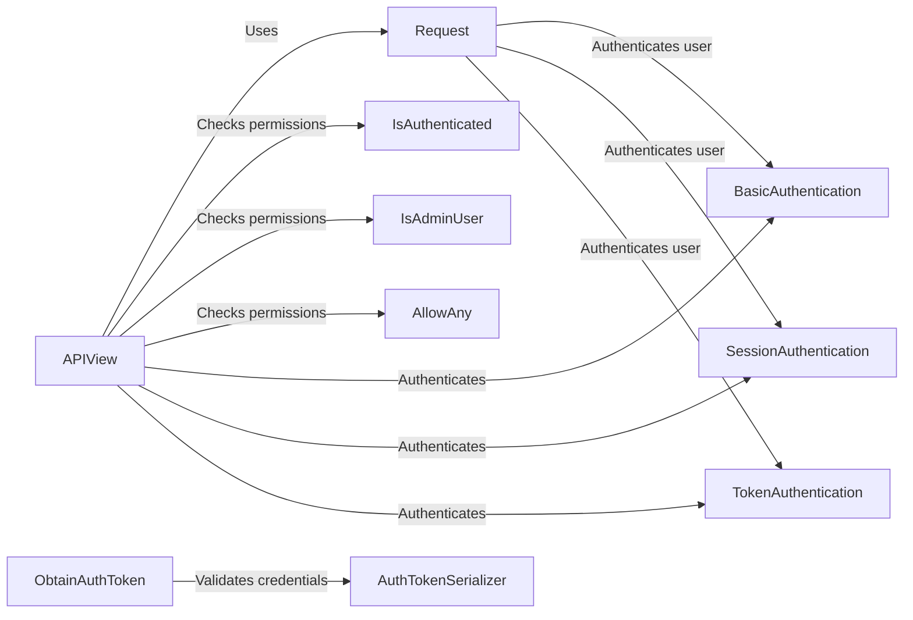

## Component Details

The Authentication & Authorization component in Django REST Framework ensures secure access to resources by verifying user identities and permissions. It uses a combination of authentication schemes (Basic, Session, Token) and permission classes (IsAuthenticated, IsAdminUser, AllowAny) to control access to API views. The APIView base class handles the authentication and permission checks, while the Request object provides access to the authenticated user and credentials. ObtainAuthToken allows clients to exchange username/password for a token.

### APIView
The base class for building API views in Django REST Framework. It provides the core functionality for handling requests, authenticating users, checking permissions, and serializing responses. It orchestrates the authentication and permission checking process by using authentication classes and permission classes.
- **Related Classes/Methods**: `rest_framework.views.APIView`

### Request
Represents an HTTP request in Django REST Framework, extending the standard Django HttpRequest. It provides access to parsed request data, authenticated user, and authentication context. It is used by authentication classes to authenticate the user.
- **Related Classes/Methods**: `rest_framework.request.Request`

### BasicAuthentication
Authenticates users using HTTP Basic Authentication. It extracts credentials from the 'Authorization' header and attempts to authenticate the user against the configured authentication backend.
- **Related Classes/Methods**: `rest_framework.authentication.BasicAuthentication`

### SessionAuthentication
Authenticates users using Django's session framework. It relies on the presence of a session cookie and CSRF protection to verify the user's identity.
- **Related Classes/Methods**: `rest_framework.authentication.SessionAuthentication`

### TokenAuthentication
Authenticates users using a token-based authentication scheme. It looks for a token in the 'Authorization' header and authenticates the user if a matching token is found in the database.
- **Related Classes/Methods**: `rest_framework.authentication.TokenAuthentication`

### IsAuthenticated
A permission class that restricts access to only authenticated users. It checks if the user is authenticated before allowing access to the view.
- **Related Classes/Methods**: `rest_framework.permissions.IsAuthenticated`

### IsAdminUser
A permission class that restricts access to only admin users. It checks if the user is an admin before allowing access to the view.
- **Related Classes/Methods**: `rest_framework.permissions.IsAdminUser`

### AllowAny
A permission class that allows unrestricted access to any user, regardless of whether they are authenticated or not. It effectively disables permission checking for the view.
- **Related Classes/Methods**: `rest_framework.permissions.AllowAny`

### ObtainAuthToken
A view that allows users to obtain an authentication token by providing their username and password. It uses AuthTokenSerializer to validate the credentials and create a new token for the user.
- **Related Classes/Methods**: `rest_framework.authtoken.views.ObtainAuthToken`

### AuthTokenSerializer
A serializer used by the ObtainAuthToken view to validate the username and password provided by the user. It checks if the user exists and if the password is correct.
- **Related Classes/Methods**: `rest_framework.authtoken.serializers.AuthTokenSerializer`
