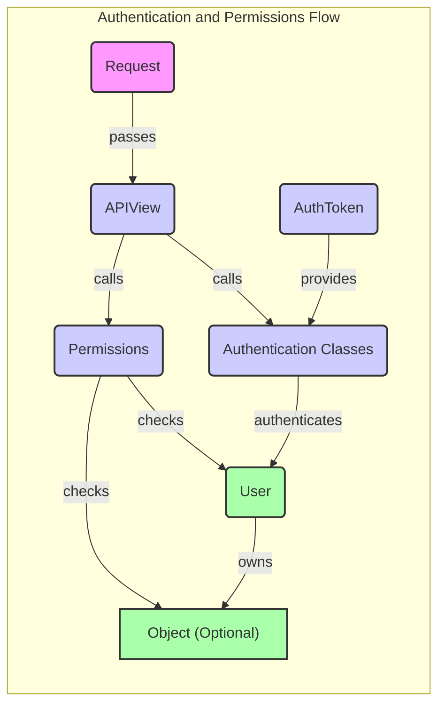

### Component Descriptions:

*   **Request**: Represents an incoming HTTP request. It encapsulates all the information about the request, including headers, body, and authentication details. It passes the request to the APIView for processing.
    *   Relevant source files: `rest_framework.request.Request`
*   **APIView**: The base class for building API views. It receives the request, performs authentication and permission checks, and dispatches the request to the appropriate handler method. It calls the Authentication and Permissions components to handle access control.
    *   Relevant source files: `rest_framework.views.APIView`
*   **Authentication Classes**: Handles user authentication. It examines the request for authentication credentials (e.g., tokens, session cookies) and authenticates the user. It authenticates the user and provides the user object to the APIView. It is used by `APIView`.
    *   Relevant source files: `rest_framework.authentication.BasicAuthentication`, `rest_framework.authentication.SessionAuthentication`, `rest_framework.authentication.TokenAuthentication`
*   **Permissions**: Determines whether the authenticated user has permission to access the requested resource. It checks both object-level and model-level permissions. It checks permissions based on the user and the object (if applicable) and allows or denies access. It is used by `APIView`.
    *   Relevant source files: `rest_framework.permissions.DjangoModelPermissions`, `rest_framework.permissions.DjangoObjectPermissions`, `rest_framework.permissions.BasePermission`
*   **User**: Represents the authenticated user. It is the entity that owns the objects and has permissions associated with it. It is authenticated by the Authentication component and checked for permissions by the Permissions component.
    *   Relevant source files: `django.contrib.auth.models.User`
*   **Object (Optional)**: Represents the object being accessed. Object-level permissions are checked against this object. It is owned by the User and its access is controlled by the Permissions component.
    *   Relevant source files: (Varies depending on the model)
*   **AuthToken**: Provides authentication tokens for users. It is used by the Authentication component to authenticate users based on tokens.
    *   Relevant source files: `rest_framework.authtoken.serializers.AuthTokenSerializer`, `rest_framework.authtoken.views.ObtainAuthToken`
