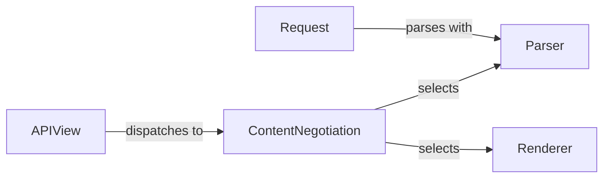

## Component Details

The Content Negotiation & Rendering component is responsible for determining the appropriate content type for both the request and the response in Django REST Framework. It selects the parser to process the incoming request data based on the request's content type and the available parsers. Similarly, it selects the renderer to format the outgoing response data based on the client's 'Accept' header and the available renderers. This process ensures that the API can handle various data formats and deliver responses in the format preferred by the client.

### APIView
The APIView is the base class for all views in Django REST Framework. It handles the initial request processing, including content negotiation, authentication, permission checks, and throttling. It determines the appropriate parser and renderer to use based on the request and then dispatches the request to the appropriate handler method.
- **Related Classes/Methods**: `rest_framework.views.APIView`

### Request
The Request object extends the standard Django HttpRequest to provide more flexible request parsing and content negotiation. It encapsulates the incoming request data and provides a unified interface for accessing it. It also handles parsing the request body using the selected parser.
- **Related Classes/Methods**: `rest_framework.request.Request`

### ContentNegotiation
The ContentNegotiation interface defines how the appropriate parser and renderer are selected based on the client's request. The DefaultContentNegotiation class provides a default implementation that uses the 'Accept' header to determine the preferred content type. It interacts with the Parser and Renderer components to select the most suitable ones.
- **Related Classes/Methods**: `rest_framework.negotiation.ContentNegotiation`, `rest_framework.negotiation.DefaultContentNegotiation`

### Parser
The Parser interface defines how the request body is parsed into a usable data structure. Different parser classes handle different content types, such as JSON, form data, and multipart form data. The selected parser transforms the raw request data into a Python object that can be easily processed by the view.
- **Related Classes/Methods**: `rest_framework.parsers.Parser`, `rest_framework.parsers.JSONParser`, `rest_framework.parsers.MultiPartParser`, `rest_framework.parsers.FileUploadParser`

### Renderer
The Renderer interface defines how the response data is rendered into a specific format. Different renderer classes handle different content types, such as JSON, HTML, and XML. The selected renderer transforms the Python object returned by the view into a format that can be understood by the client.
- **Related Classes/Methods**: `rest_framework.renderers.Renderer`, `rest_framework.renderers.JSONRenderer`, `rest_framework.renderers.TemplateHTMLRenderer`, `rest_framework.renderers.BrowsableAPIRenderer`
