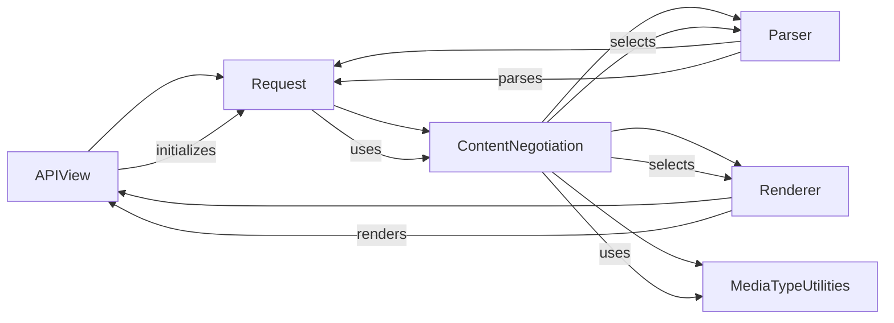

```mermaid
graph LR
    APIView --> Request
    Request --> ContentNegotiation
    ContentNegotiation --> Parser
    ContentNegotiation --> Renderer
    ContentNegotiation --> MediaTypeUtilities
    Parser --> Request
    Renderer --> APIView

    APIView-- initializes --> Request
    Request-- uses --> ContentNegotiation
    ContentNegotiation-- selects --> Parser
    ContentNegotiation-- selects --> Renderer
    ContentNegotiation-- uses --> MediaTypeUtilities
    Parser-- parses --> Request
    Renderer-- renders --> APIView
```

