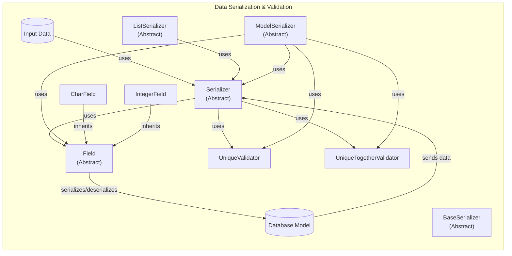

## Data Serialization & Validation Component Overview

This component is responsible for serializing complex data structures, such as model instances, into Python primitives that can be easily rendered into formats like JSON. It also handles the reverse process, deserializing primitive data back into complex data types, while performing validation to ensure data integrity.

### Component Descriptions:

*   **Input Data:** Represents the raw data received from a request, typically in a format like JSON. It *uses* the Serializer to be validated and transformed.
    *   Relevant source files: N/A
*   **BaseSerializer:** The abstract base class for all serializers, providing the fundamental structure for serialization and deserialization. It *uses* `to_representation` and `to_internal_value` methods.
    *   Relevant source files: `rest_framework/serializers.py`
*   **Serializer:** An abstract class that extends `BaseSerializer` and provides a more feature-rich implementation, including field handling and validation. It *uses* Field instances to define the structure of the data and *uses* validators to enforce data constraints.
    *   Relevant source files: `rest_framework/serializers.py`
*   **ListSerializer:** An abstract class designed to handle lists of objects, using a child serializer to process each item in the list. It *uses* Serializer for serializing each element of the list.
    *   Relevant source files: `rest_framework/serializers.py`
*   **ModelSerializer:** An abstract class that simplifies the creation of serializers for Django models by automatically generating fields and validators based on the model's structure. It *uses* Field and Validator classes and *sends data* to the database model.
    *   Relevant source files: `rest_framework/serializers.py`
*   **Field:** An abstract base class for all field types, responsible for serializing, deserializing, and validating individual data points. It *serializes/deserializes* data to and from the database model.
    *   Relevant source files: `rest_framework/fields.py`
*   **CharField:** A concrete field type for handling string data, inheriting from the base Field class. It *inherits* from Field.
    *   Relevant source files: `rest_framework/fields.py`
*   **IntegerField:** A concrete field type designed for handling integer data, extending the Field class. It *inherits* from Field.
    *   Relevant source files: `rest_framework/fields.py`
*   **UniqueValidator:** A validator that checks for the uniqueness of a field's value, typically used to ensure data integrity in databases. It *is used by* Serializer and ModelSerializer.
    *   Relevant source files: `rest_framework/validators.py`
*   **UniqueTogetherValidator:** A validator that checks for the uniqueness of a combination of fields, ensuring that the combination is unique across the dataset. It *is used by* Serializer and ModelSerializer.
    *   Relevant source files: `rest_framework/validators.py`
*   **Database Model:** Represents the data structure in the database. It *sends data* to Serializer and *is serialized/deserialized* by Field.
    *   Relevant source files: N/A
