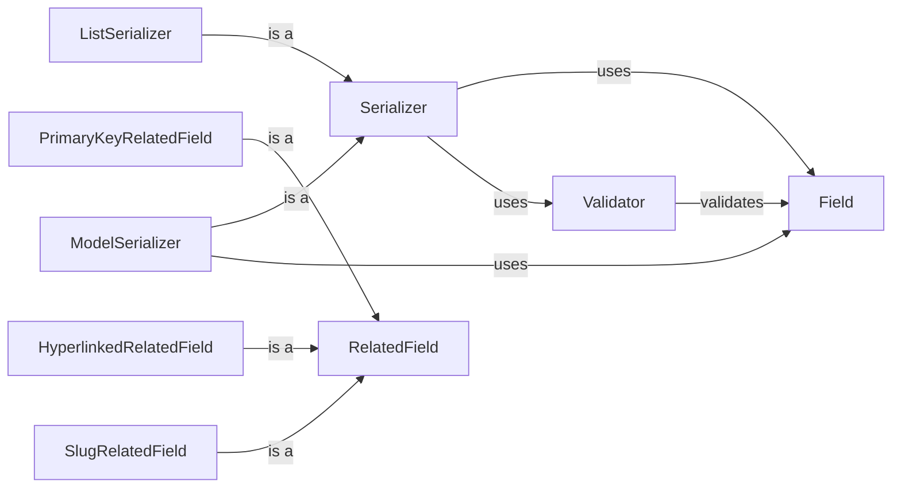

## Component Details

The Data Serialization & Validation component in Django REST framework is responsible for converting data between Python objects and representations like JSON. It uses serializers to define the structure of the data, perform validation, and serialize/deserialize data. The process begins with defining serializers that specify the fields to be included in the serialized output and the validation rules to be applied during deserialization. When serializing data, the serializer takes a Python object and transforms it into a JSON representation. Conversely, when deserializing data, the serializer takes a JSON representation and converts it into a Python object, while also validating the data against the defined rules. This component ensures data integrity and consistency throughout the application.

### Serializer
The Serializer class is the core component for converting data between Python objects and JSON representations. It orchestrates the serialization and deserialization process using defined fields and validators. It defines the overall structure of the data and manages the interaction between fields and validators. It provides methods for validating input data, serializing Python objects into JSON, and deserializing JSON into Python objects.
- **Related Classes/Methods**: `rest_framework.serializers.BaseSerializer`, `rest_framework.serializers.Serializer`

### Field
The Field class is the base class for all field types, responsible for defining how values are serialized and deserialized. It handles validation, data conversion, and representation transformations. It defines the structure and constraints for individual data elements. Each field type (e.g., CharField, IntegerField) inherits from this class and implements specific serialization and deserialization logic.
- **Related Classes/Methods**: `rest_framework.fields.Field`

### Validator
Validators are classes responsible for validating data and ensuring it meets specific criteria. They are used to enforce constraints such as uniqueness, data types, and custom validation rules. They ensure data integrity and consistency. Validators are typically used in conjunction with Serializer and Field classes to validate data during deserialization.
- **Related Classes/Methods**: `rest_framework.validators.UniqueValidator`, `rest_framework.validators.UniqueTogetherValidator`

### RelatedField
A specialized field for handling relationships between models. It manages the serialization and deserialization of related objects, providing options for primary key, hyperlinked, and slug-based relationships. It simplifies the handling of foreign key relationships in models.
- **Related Classes/Methods**: `rest_framework.relations.RelatedField`, `rest_framework.relations.PrimaryKeyRelatedField`, `rest_framework.relations.HyperlinkedRelatedField`, `rest_framework.relations.SlugRelatedField`

### ListSerializer
Deals with serializing and deserializing lists of objects. It's used when a serializer needs to handle multiple instances of a model or data structure.
- **Related Classes/Methods**: `rest_framework.serializers.ListSerializer`

### ModelSerializer
A shortcut for creating serializers that deal with Django models. It automatically generates fields and validators based on the model's structure.
- **Related Classes/Methods**: `rest_framework.serializers.ModelSerializer`
