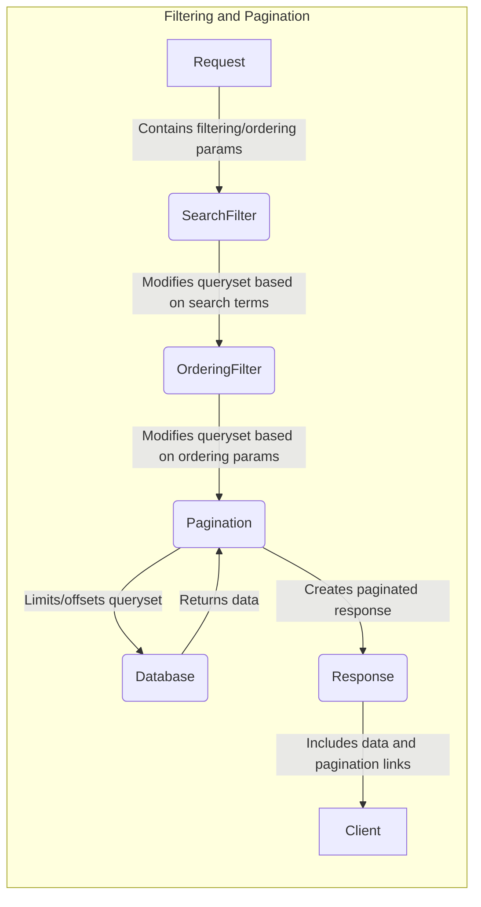

## Filtering and Pagination Overview

This component provides filtering and pagination capabilities for list views, enabling efficient handling of large datasets. It modifies the data retrieved from the database before it is serialized and rendered.

Here's a data flow diagram illustrating the interaction between the key components:

### Component Descriptions:

*   **Request:** Represents the incoming HTTP request from the client. It contains parameters related to filtering, searching, and pagination.
    *   Purpose: Initiates the filtering and pagination process by carrying the client's requirements.
    *   Interaction: The request object is the entry point, providing data to `SearchFilter`.
    *   Relevant source files: N/A (HTTP Request)

*   **SearchFilter:** Responsible for filtering the queryset based on search terms extracted from the request.
    *   Purpose: Reduces the dataset based on user-provided search criteria.
    *   Interaction: Receives the request, filters the queryset, and passes the modified queryset to `OrderingFilter`.
    *   Relevant source files: `rest_framework.filters.SearchFilter`

*   **OrderingFilter:** Orders the queryset based on the ordering parameters specified in the request.
    *   Purpose: Arranges the data in a specific order as requested by the user.
    *   Interaction: Receives the queryset from `SearchFilter`, applies ordering, and passes the modified queryset to `Pagination`.
    *   Relevant source files: `rest_framework.filters.OrderingFilter`

*   **Pagination:** Handles the pagination of the queryset, dividing it into pages and generating links for navigation.
    *   Purpose: Divides large datasets into smaller, manageable chunks for efficient display.
    *   Interaction: Receives the queryset from `OrderingFilter`, paginates it, retrieves data from the `Database`, and creates a paginated response.
    *   Relevant source files: `rest_framework.pagination.PageNumberPagination`, `rest_framework.pagination.LimitOffsetPagination`, `rest_framework.pagination.CursorPagination`

*   **Database:** Represents the data storage system.
    *   Purpose: Stores and retrieves the data.
    *   Interaction: Interacted with by `Pagination` to retrieve the data for the current page.
    *   Relevant source files: N/A (Database system)

*   **Response:** Creates the HTTP response containing the paginated data and pagination links.
    *   Purpose: Packages the data and metadata for transmission to the client.
    *   Interaction: Receives the paginated data from `Pagination` and constructs the response to be sent to the `Client`.
    *   Relevant source files: `rest_framework.response.Response`

*   **Client:** The user or application consuming the API.
    *   Purpose: To display the data.
    *   Interaction: Receives the response from the server.
    *   Relevant source files: N/A
