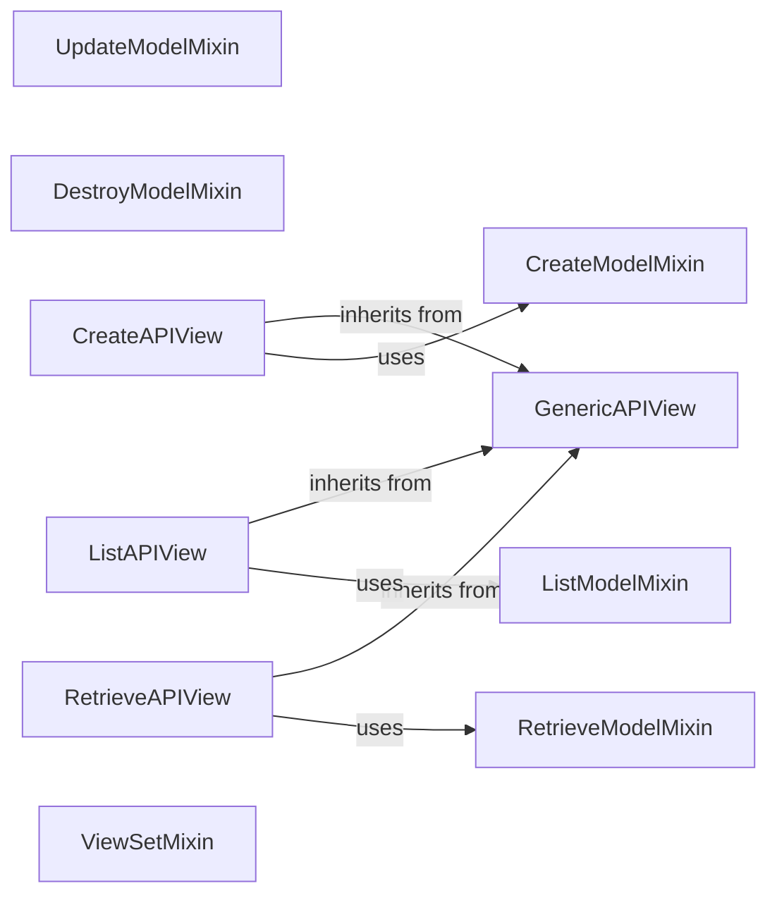

## Component Details

The Generic Views & ViewSets component in Django REST Framework provides a set of pre-built views and mixins that simplify the process of building common API patterns. It leverages `GenericAPIView` as a base class, offering core functionalities like authentication, permission checking, and content negotiation. Mixins such as `CreateModelMixin`, `ListModelMixin`, `RetrieveModelMixin`, `UpdateModelMixin`, and `DestroyModelMixin` provide implementations for standard actions. Concrete views like `CreateAPIView`, `ListAPIView`, `RetrieveAPIView`, `UpdateAPIView`, `DestroyAPIView`, and their combinations offer ready-to-use endpoints for basic CRUD operations. `ViewSetMixin` allows grouping related views into a single class, enabling more complex API structures.

### GenericAPIView
The base class for all generic views, providing core functionalities like authentication, permission checking, content negotiation, and pagination.
- **Related Classes/Methods**: `rest_framework.generics.GenericAPIView`

### CreateModelMixin
A mixin that provides the `create` method for creating new resources, handling data validation and saving.
- **Related Classes/Methods**: `rest_framework.mixins.CreateModelMixin`

### ListModelMixin
A mixin that provides the `list` method for listing a collection of resources, including queryset retrieval, serialization, and pagination.
- **Related Classes/Methods**: `rest_framework.mixins.ListModelMixin`

### RetrieveModelMixin
A mixin that provides the `retrieve` method for retrieving a single resource based on its identifier, followed by serialization.
- **Related Classes/Methods**: `rest_framework.mixins.RetrieveModelMixin`

### UpdateModelMixin
A mixin that provides the `update` and `partial_update` methods for updating existing resources, using a serializer for validation and saving.
- **Related Classes/Methods**: `rest_framework.mixins.UpdateModelMixin`

### DestroyModelMixin
A mixin that provides the `destroy` method for deleting existing resources from the database.
- **Related Classes/Methods**: `rest_framework.mixins.DestroyModelMixin`

### CreateAPIView
A concrete view that combines `GenericAPIView` with `CreateModelMixin` to provide an endpoint for creating new resources.
- **Related Classes/Methods**: `rest_framework.generics.CreateAPIView`

### ListAPIView
A concrete view that combines `GenericAPIView` with `ListModelMixin` to provide an endpoint for listing resources.
- **Related Classes/Methods**: `rest_framework.generics.ListAPIView`

### RetrieveAPIView
A concrete view that combines `GenericAPIView` with `RetrieveModelMixin` to provide an endpoint for retrieving a single resource.
- **Related Classes/Methods**: `rest_framework.generics.RetrieveAPIView`

### ViewSetMixin
A mixin that provides a way to group related views into a single class, mapping different actions (methods) to different URL patterns.
- **Related Classes/Methods**: `rest_framework.viewsets.ViewSetMixin`
