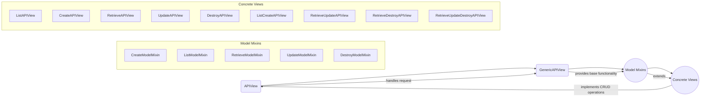

### Component Descriptions:

**1. APIView**
*   **Description:** The base class for all API views in Django REST framework. It provides the core functionality for handling requests and responses.
*   **Functionality:** Receives HTTP requests, dispatches to appropriate handler methods (e.g., `get`, `post`, `put`, `delete`), and returns HTTP responses.
*   **Relationships:**
    *   Extends: `rest_framework.views.APIView`
    *   Used by: `GenericAPIView`
*   **Relevant source files:** `rest_framework.views.APIView`

**2. GenericAPIView**
*   **Description:** Provides common behavior for API views, such as authentication, permissions, throttling, and content negotiation. It also handles queryset filtering and pagination.
*   **Functionality:**
    *   Performs authentication, permission checks, and throttling.
    *   Provides methods for retrieving, filtering, and paginating querysets.
    *   Handles serialization and deserialization of data.
*   **Relationships:**
    *   Extends: `APIView`
    *   Used by: `ListAPIView`, `CreateAPIView`, `RetrieveAPIView`, `UpdateAPIView`, `DestroyAPIView`, `ListCreateAPIView`, `RetrieveUpdateAPIView`, `RetrieveDestroyAPIView`, `RetrieveUpdateDestroyAPIView`
*   **Relevant source files:** `rest_framework.generics.GenericAPIView`

**3. Model Mixins**
*   **Description:** Provide reusable logic for performing common database operations (CRUD - Create, Read, Update, Delete) on model instances.
*   **Functionality:**
    *   `CreateModelMixin`: Creates a new model instance.
    *   `ListModelMixin`: Lists a queryset of model instances.
    *   `RetrieveModelMixin`: Retrieves a single model instance.
    *   `UpdateModelMixin`: Updates an existing model instance.
    *   `DestroyModelMixin`: Deletes a model instance.
*   **Relationships:**
    *   Used by: `ListAPIView`, `CreateAPIView`, `RetrieveAPIView`, `UpdateAPIView`, `DestroyAPIView`, `ListCreateAPIView`, `RetrieveUpdateAPIView`, `RetrieveDestroyAPIView`, `RetrieveUpdateDestroyAPIView`
*   **Relevant source files:** `rest_framework.mixins.CreateModelMixin`, `rest_framework.mixins.ListModelMixin`, `rest_framework.mixins.RetrieveModelMixin`, `rest_framework.mixins.UpdateModelMixin`, `rest_framework.mixins.DestroyModelMixin`

**4. Concrete Views**
*   **Description:** Combine `GenericAPIView` and one or more model mixins to provide complete implementations for common API endpoints.
*   **Functionality:**
    *   `ListAPIView`: Lists a queryset.
    *   `CreateAPIView`: Creates a new model instance.
    *   `RetrieveAPIView`: Retrieves a single model instance.
    *   `UpdateAPIView`: Updates an existing model instance.
    *   `DestroyAPIView`: Deletes a model instance.
    *   `ListCreateAPIView`: Lists a queryset or creates a new model instance.
    *   `RetrieveUpdateAPIView`: Retrieves or updates a model instance.
    *   `RetrieveDestroyAPIView`: Retrieves or deletes a model instance.
    *   `RetrieveUpdateDestroyAPIView`: Retrieves, updates, or deletes a model instance.
*   **Relationships:**
    *   Extends: `GenericAPIView` and one or more model mixins.
    *   Used by: API endpoints in the application.
*   **Relevant source files:** `rest_framework.generics.ListAPIView`, `rest_framework.generics.CreateAPIView`, `rest_framework.generics.RetrieveAPIView`, `rest_framework.generics.UpdateAPIView`, `rest_framework.generics.DestroyAPIView`, `rest_framework.generics.ListCreateAPIView`, `rest_framework.generics.RetrieveUpdateAPIView`, `rest_framework.generics.RetrieveDestroyAPIView`, `rest_framework.generics.RetrieveUpdateDestroyAPIView`