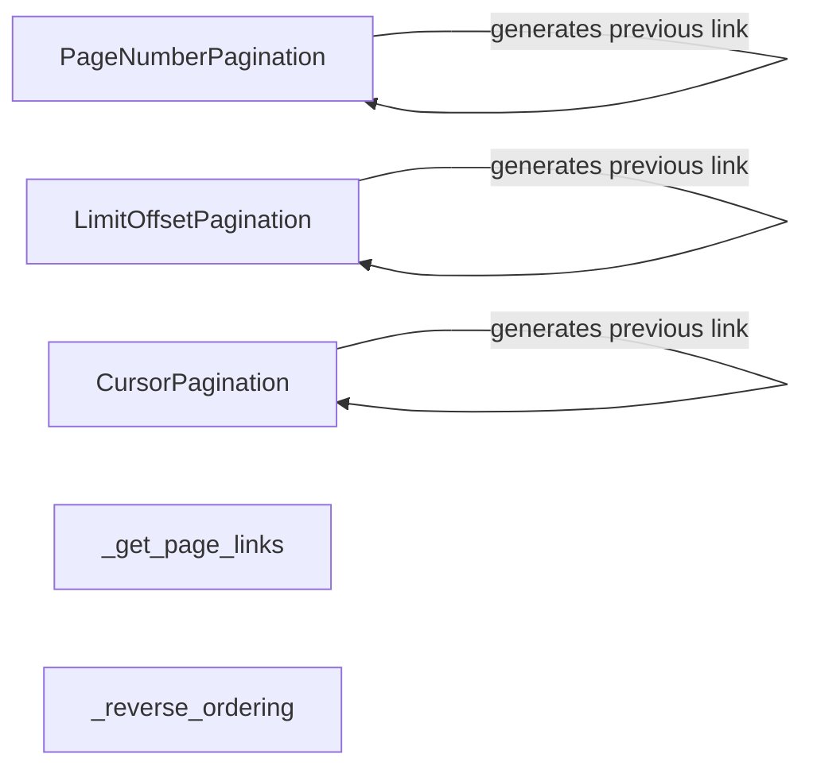

## Component Details

The Pagination component in Django REST Framework provides a standardized way to divide large result sets into discrete pages. This enhances API performance by limiting the amount of data transferred in a single request and improves usability by allowing clients to navigate through the data in manageable chunks. The core of the pagination system revolves around abstract classes that define the pagination style and helper functions that generate links and reverse ordering.

### PageNumberPagination
This component implements pagination using page numbers. It allows clients to request specific pages of data. It provides methods for paginating a queryset, generating links to the next and previous pages, and creating a paginated response. It is useful when clients need to jump to specific pages or navigate sequentially.
- **Related Classes/Methods**: `rest_framework.pagination.PageNumberPagination`

### LimitOffsetPagination
This component implements pagination using a limit and offset. The limit specifies the maximum number of items to return, and the offset specifies the starting position. It provides methods for paginating a queryset, generating links to the next and previous pages, and creating a paginated response. It is suitable for simple pagination scenarios where clients need to retrieve a fixed number of items starting from a specific position.
- **Related Classes/Methods**: `rest_framework.pagination.LimitOffsetPagination`

### CursorPagination
This component implements pagination using a cursor. A cursor is an opaque value that represents a specific position in the result set. It provides methods for paginating a queryset, encoding and decoding the cursor, generating links to the next and previous pages, and creating a paginated response. It is useful for very large datasets where page numbers or offsets are not practical.
- **Related Classes/Methods**: `rest_framework.pagination.CursorPagination`

### _get_page_links
This helper function generates the links for the next and previous pages in a paginated result set. It takes the request, paginator, and page number as input and returns a dictionary containing the URLs for the next and previous pages. It is used by the pagination classes to construct the paginated response.
- **Related Classes/Methods**: `rest_framework.pagination:_get_page_links`

### _reverse_ordering
This helper function reverses the ordering of a queryset. It is used by the CursorPagination class to ensure that the results are returned in the correct order when paginating backwards.
- **Related Classes/Methods**: `rest_framework.pagination:_reverse_ordering`
