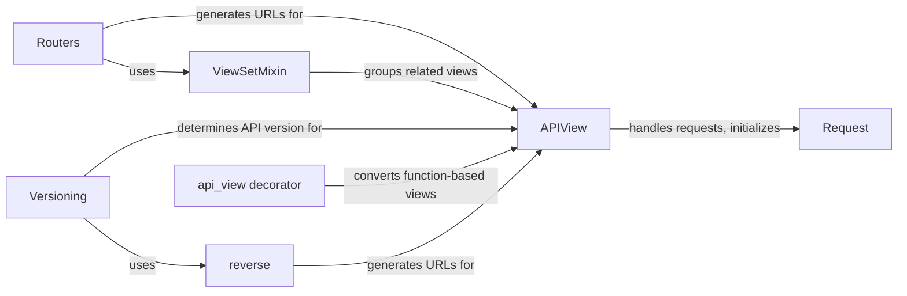

## Component Details

The Request Handling & Routing component is responsible for managing incoming HTTP requests and directing them to the appropriate view for processing. It encompasses the entire lifecycle of a request, from initial reception and parsing to the generation and delivery of a response. This involves utilizing routers to map URLs to views, employing APIView as the base class for handling requests with built-in functionalities like authentication and content negotiation, and leveraging the Request class to represent and access request data. Versioning is also handled to support different API versions. The component ensures that requests are processed securely and efficiently, and that responses are formatted according to the client's specifications.

### APIView
APIView is the base class for all class-based views in Django REST framework. It provides the fundamental structure for handling HTTP requests, including request parsing, authentication, permission checking, content negotiation, and response rendering. It acts as the central processing unit for incoming requests, orchestrating the various stages of request handling and response generation.
- **Related Classes/Methods**: `rest_framework.views.APIView`

### Request
The Request class encapsulates an incoming HTTP request, providing a structured way to access request data, headers, and metadata. It extends Django's HttpRequest class with additional features such as request parsing and authentication. It serves as the primary interface for accessing request information within API views.
- **Related Classes/Methods**: `rest_framework.request.Request`

### Routers
Routers automatically generate URL patterns for common API patterns, such as list, create, retrieve, update, and delete operations. They simplify the process of defining API endpoints by providing a standardized way to map URLs to views. Different router types offer varying levels of default functionality, catering to different API design needs.
- **Related Classes/Methods**: `rest_framework.routers.BaseRouter`, `rest_framework.routers.SimpleRouter`, `rest_framework.routers.DefaultRouter`, `rest_framework.routers.APIRootView`

### ViewSetMixin
ViewSetMixin provides a way to group related views into a single class, simplifying the creation of complex APIs. It offers a set of pre-defined actions (list, create, retrieve, update, delete) that can be customized to implement specific API behavior. It works in conjunction with Routers to generate URL patterns for the viewset.
- **Related Classes/Methods**: `rest_framework.viewsets.ViewSetMixin`

### Versioning
Versioning classes handle API versioning, allowing you to support multiple versions of your API simultaneously. They determine the API version from the request and provide a mechanism for generating URLs based on the version. Different versioning schemes use different parts of the request (e.g., headers, URL path, query parameters) to determine the version.
- **Related Classes/Methods**: `rest_framework.versioning.BaseVersioning`, `rest_framework.versioning.AcceptHeaderVersioning`, `rest_framework.versioning.URLPathVersioning`, `rest_framework.versioning.NamespaceVersioning`, `rest_framework.versioning.HostNameVersioning`, `rest_framework.versioning.QueryParameterVersioning`

### api_view decorator
The `api_view` decorator transforms a function-based view into an API view compatible with Django REST framework. It handles request parsing, authentication, permission checking, and content negotiation, effectively wrapping a standard Django view function to provide REST framework functionality.
- **Related Classes/Methods**: `rest_framework.decorators.api_view`

### reverse
The `reverse` function generates URLs for API endpoints based on view names and parameters. It is used by Routers and Versioning classes to create URLs that point to specific API resources. It provides a centralized way to manage URL generation, ensuring consistency and accuracy.
- **Related Classes/Methods**: `rest_framework.reverse.reverse`
