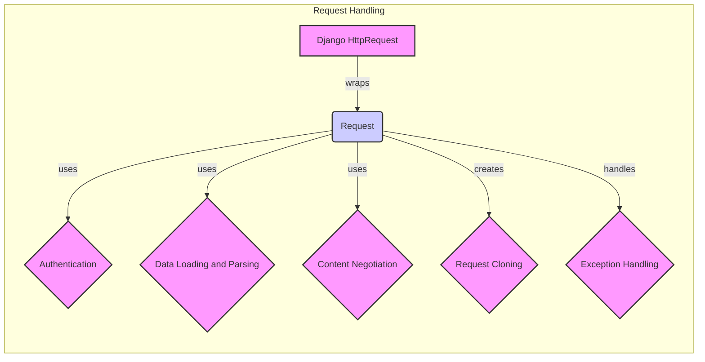

## Request Handling Component Overview

This component focuses on handling incoming HTTP requests within the Django REST Framework. It provides a richer interface to the standard Django request, including data parsing, authentication, and content negotiation.

### Component Descriptions:

- **Django HttpRequest**:
  - *Description*: The standard Django HTTP request object.
  - *Functionality*: Receives the raw HTTP request from the client.
  - *Interaction*: Wrapped by the `Request` object to provide a richer API.
  - *Source Files*: `django.http.HttpRequest`

- **Request**:
  - *Description*: Wraps the Django request object, parses request data, handles authentication, and provides a richer API for accessing request information.
  - *Functionality*: Provides a unified interface for accessing request data, handling authentication, and content negotiation.
  - *Interaction*: Wraps `HttpRequest`, uses `Authentication`, `Data Loading and Parsing`, `Content Negotiation`, creates `Request Cloning`, and handles `Exception Handling`.
  - *Source Files*: `rest_framework.request.Request`

- **Authentication**:
  - *Description*: Handles the authentication of the request, identifying the user and any associated authentication credentials.
  - *Functionality*: Authenticates the user based on provided credentials.
  - *Interaction*: Used by `Request` to authenticate the user.
  - *Source Files*: `rest_framework.request.Request._authenticate`, `rest_framework.request.ForcedAuthentication.authenticate`

- **Data Loading and Parsing**:
  - *Description*: Loads and parses the request data, handling different content types and form parsing.
  - *Functionality*: Parses the request body based on the content type.
  - *Interaction*: Used by `Request` to load and parse request data.
  - *Source Files*: `rest_framework.request.Request._load_data_and_files`, `rest_framework.request.Request._parse`

- **Content Negotiation**:
  - *Description*: Selects the appropriate parser and renderer based on the request's content type and accepted media types.
  - *Functionality*: Determines the appropriate parser and renderer to use.
  - *Interaction*: Used by `Request` to select the parser.
  - *Source Files*: `rest_framework.request.Request._default_negotiator`

- **Request Cloning**:
  - *Description*: Clones the request object, potentially for use in overridden methods.
  - *Functionality*: Creates a copy of the request object.
  - *Interaction*: Created by `Request` for method overriding.
  - *Source Files*: `rest_framework.request.clone_request`

- **Exception Handling**:
  - *Description*: Wraps attribute errors to provide more informative error messages.
  - *Functionality*: Handles attribute errors during request processing.
  - *Interaction*: Used by `Request` to handle exceptions.
  - *Source Files*: `rest_framework.request.wrap_attributeerrors`
