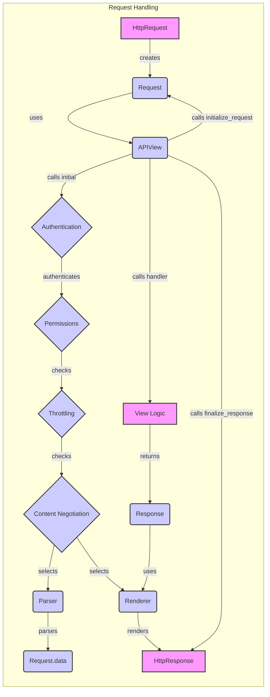

## Request Handling Component Overview

This diagram illustrates the flow of an incoming HTTP request through the Django REST Framework, focusing on request handling, authentication, content negotiation, and response rendering.

### Components Description:

*   **HttpRequest**: Represents the raw HTTP request received by the Django application. It's the initial request object before DRF processing.
    *   **Source files:** `django.http.HttpRequest`

*   **Request**: A wrapper around the `HttpRequest` that provides enhanced functionality, such as content parsing and authentication. It uses parsers, authenticators and content negotiators.
    *   **Source files:** `rest_framework.request.Request`

*   **APIView**: The base class for all DRF views. It handles request initialization, authentication, permission checks, throttling, content negotiation, and response finalization. It uses authentication, permissions, throttling, content negotiation.
    *   **Source files:** `rest_framework.views.APIView`

*   **Authentication**: Authenticates the user associated with the request. It checks credentials and sets `request.user` and `request.auth`.
    *   **Source files:** `rest_framework.authentication.BasicAuthentication`, `rest_framework.authentication.SessionAuthentication`, `rest_framework.authentication.TokenAuthentication`

*   **Permissions**: Checks if the authenticated user has the necessary permissions to access the view or object.
    *   **Source files:** `rest_framework.permissions`

*   **Throttling**: Checks if the request should be throttled based on configured rate limits.
    *   **Source files:** `rest_framework.throttling`

*   **Content Negotiation**: Selects the appropriate parser and renderer based on the request's `Content-Type` and `Accept` headers.
    *   **Source files:** `rest_framework.negotiation.DefaultContentNegotiation`

*   **Parser**: Parses the request body into a usable data format (e.g., JSON, form data).
    *   **Source files:** `rest_framework.parsers.JSONParser`, `rest_framework.parsers.FormParser`, `rest_framework.parsers.MultiPartParser`

*   **Request.data**: Property of the `Request` object that holds the parsed request data.
    *   **Source files:** `rest_framework.request.Request`

*   **Renderer**: Renders the response data into the desired format (e.g., JSON, HTML).
    *   **Source files:** `rest_framework.renderers.JSONRenderer`, `rest_framework.renderers.BrowsableAPIRenderer`

*   **View Logic**: Represents the actual business logic of the view, which processes the request and returns a response.
    *   **Source files:** (Specific to each view)

*   **Response**: A DRF-specific response object that encapsulates the data to be returned to the client.
    *   **Source files:** `rest_framework.response.Response`

*   **HttpResponse**: The final HTTP response sent back to the client.
    *   **Source files:** `django.http.HttpResponse`