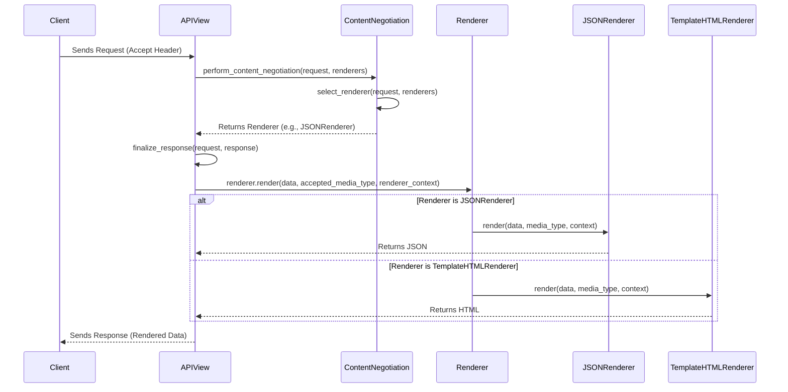

## Response Rendering Flow

This diagram illustrates the flow of how the API response is rendered in Django REST framework, focusing on content negotiation and the rendering process.

## Components

-   **Client**
    -   *Description*: The client making the API request, specifying the desired content type via the `Accept` header.
    -   *Functionality*: Initiates the request and receives the rendered response.
    -   *Source Files*: N/A (External entity)

-   **APIView**
    -   *Description*: The base class for all API views. It orchestrates the content negotiation and rendering process.
    -   *Functionality*: Receives the request, performs content negotiation, and finalizes the response by rendering the data using the selected renderer.
    -   *Interactions*: Interacts with `ContentNegotiation` to select a renderer and with the `Renderer` to render the data.
    -   *Source Files*: `rest_framework.views.APIView`

-   **ContentNegotiation**
    -   *Description*: Selects the appropriate renderer based on the client's `Accept` header and the available renderers.
    -   *Functionality*: Examines the request and available renderers to determine the best renderer to use.
    -   *Interactions*: Called by `APIView` to select a renderer.
    -   *Source Files*: `rest_framework.negotiation.ContentNegotiation`, `rest_framework.negotiation.DefaultContentNegotiation`

-   **Renderer**
    -   *Description*: An abstract base class for renderers. Defines the `render` method that subclasses must implement.
    -   *Functionality*: Converts data into a specific media type.
    -   *Interactions*: Subclasses like `JSONRenderer` and `TemplateHTMLRenderer` implement the `render` method.
    -   *Source Files*: `rest_framework.renderers.BaseRenderer`

-   **JSONRenderer**
    -   *Description*: A concrete renderer that converts data into JSON format.
    -   *Functionality*: Implements the `render` method to serialize data into JSON.
    -   *Interactions*: Used by `APIView` when JSON is the selected media type.
    -   *Source Files*: `rest_framework.renderers.JSONRenderer`

-   **TemplateHTMLRenderer**
    -   *Description*: A concrete renderer that renders data using HTML templates.
    -   *Functionality*: Implements the `render` method to render data into HTML using a template.
    -   *Interactions*: Used by `APIView` when HTML is the selected media type.
    -   *Source Files*: `rest_framework.renderers.TemplateHTMLRenderer`
