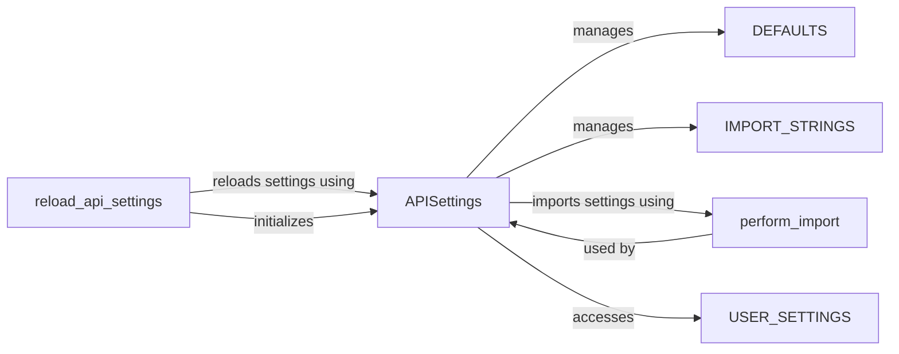

## Component Details

The Settings & Configuration component in Django REST Framework is responsible for managing and providing access to the framework's settings. It allows developers to customize various aspects of the API, such as authentication classes, permission policies, pagination styles, and more. The component loads default settings, overrides them with user-defined settings from Django's settings.py, and provides a centralized way to access these settings throughout the framework. It also handles the dynamic importing of settings defined as strings, allowing for flexible configuration options.

### APISettings
The APISettings class is the core of the settings management. It encapsulates the logic for loading, overriding, and accessing settings. It initializes with default settings and updates them with user-defined settings. It also handles the import of settings defined as strings.
- **Related Classes/Methods**: `rest_framework.settings.APISettings`

### DEFAULTS
DEFAULTS is a dictionary that holds the default settings for the Django REST Framework. These settings are used as the base configuration and are overridden by any user-defined settings.
- **Related Classes/Methods**: `rest_framework.settings`

### USER_SETTINGS
USER_SETTINGS is a property within the APISettings class that retrieves the user-defined settings from Django's settings.py. It provides access to the settings that override the defaults, allowing users to customize the framework's behavior.
- **Related Classes/Methods**: `rest_framework.settings.APISettings`

### IMPORT_STRINGS
IMPORT_STRINGS is a set containing the names of settings that should be interpreted as import strings. The perform_import function is used to resolve these strings to actual modules or classes, enabling dynamic loading of settings.
- **Related Classes/Methods**: `rest_framework.settings`

### perform_import
The perform_import function is responsible for importing a setting value. It handles string imports by resolving them to actual modules or classes, allowing for dynamic loading of settings. This function is crucial for settings that refer to classes or modules.
- **Related Classes/Methods**: `rest_framework.settings:perform_import`

### reload_api_settings
The reload_api_settings function reloads the API settings. It's called when settings are changed, updating the API settings with the new values. This ensures that the framework uses the most up-to-date settings.
- **Related Classes/Methods**: `rest_framework.settings:reload_api_settings`
