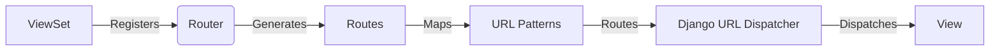

## URL Routing in Django REST Framework

This document provides an overview of the URL routing component in Django REST Framework (DRF). The routing system automatically generates URL patterns for ViewSets, simplifying the process of mapping URLs to API endpoints. It leverages the Django URL dispatcher to route requests to the appropriate views.

### Data Flow Diagram

### Components

- **ViewSet**:
  - *Description*: Defines the API endpoints and their corresponding actions (e.g., list, create, retrieve, update, delete). It provides the logic for handling requests and generating responses.
  - *Interaction*: ViewSets are registered with a Router, which then inspects the ViewSet to generate URL patterns.
  - *Source Files*: N/A (User-defined)

- **Router** (`rest_framework.routers.BaseRouter`, `rest_framework.routers.SimpleRouter`, `rest_framework.routers.DefaultRouter`):
  - *Description*: Responsible for generating URL patterns based on the registered ViewSets. It defines the conventions for mapping URLs to actions and provides a consistent way of structuring API endpoints.
  - *Interaction*: The Router receives ViewSets and generates a list of URL patterns. The `DefaultRouter` also adds an API root view.
  - *Source Files*: `rest_framework/routers.py`

- **Routes** (`rest_framework.routers.Route`, `rest_framework.routers.DynamicRoute`):
  - *Description*: Defines the structure of a URL pattern, including the URL regex, HTTP method mapping, and endpoint name. It provides a flexible way to customize the generated URLs.
  - *Interaction*: Routes are used by the Router to create the final URL patterns. Dynamic routes allow for custom actions defined in the ViewSet.
  - *Source Files*: `rest_framework/routers.py`

- **URL Patterns**:
  - *Description*: The final list of URL patterns generated by the Router. These patterns are used by the Django URL dispatcher to route incoming requests to the appropriate views.
  - *Interaction*: The URL patterns are passed to the Django URL dispatcher, which uses them to match incoming requests.
  - *Source Files*: N/A (Generated by Router)

- **Django URL Dispatcher**:
  - *Description*: Django's built-in URL dispatcher, which uses the URL patterns to route incoming requests to the appropriate views.
  - *Interaction*: The dispatcher receives incoming requests and matches them against the URL patterns. Once a match is found, the corresponding view is called.
  - *Source Files*: N/A (Django core)

- **View**:
  - *Description*: Handles the incoming request, processes the data, and returns a response. It uses the logic defined in the ViewSet to perform the requested action.
  - *Interaction*: The View receives the request from the Django URL dispatcher and uses the ViewSet to handle the request.
  - *Source Files*: N/A (DRF or User-defined)
