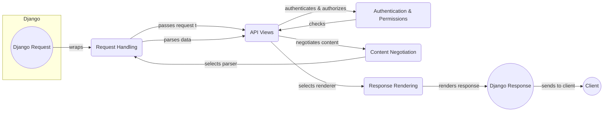

## Django REST Framework Data Flow Overview

Django REST Framework (DRF) is a powerful and flexible toolkit for building Web APIs. It provides a set of tools and abstractions that simplify the process of creating RESTful APIs, handling tasks such as request parsing, serialization, authentication, and response rendering.

### Component Descriptions:

**1. Request Handling:** This component wraps the Django request object, providing a richer API for accessing request data, handling file uploads, and managing request parameters. It receives the initial Django request and prepares it for further processing by the API views. It also uses the content negotiation to parse the request data.

**2. API Views:** The core component for handling API logic. It receives the processed request from the Request Handling component, orchestrates authentication and permission checks, and selects the appropriate renderer for the response. It interacts with the Authentication & Permissions component to ensure that the user is authorized to access the requested resource and with the Content Negotiation component to determine the appropriate response format.

**3. Authentication & Permissions:** This component handles user authentication and authorization. It checks if the user is authenticated and has the necessary permissions to access the requested resource. It receives requests from the API Views component and returns a boolean value indicating whether the request should be allowed to proceed.

**4. Content Negotiation:** This component selects the appropriate parser and renderer based on the client's request (Accept header) and the available parsers and renderers. It receives requests from the API Views component and returns the selected parser and renderer. The selected parser is used by the Request Handling component and the selected renderer is used by the Response Rendering component.

**5. Response Rendering:** This component renders the API response into a specific format (e.g., JSON, HTML) based on content negotiation. It receives the data to be rendered from the API Views component and returns the rendered response, which is then sent back to the client.