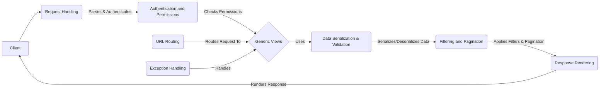

## Django REST Framework Data Flow Overview

Django REST Framework is a powerful and flexible toolkit for building Web APIs. It provides a set of tools and abstractions that make it easy to develop RESTful APIs with Django. It handles request processing, data serialization, and response rendering, and provides features like authentication, permissions, and versioning.

### Component Descriptions:

**1. Request Handling:** This component receives and processes incoming HTTP requests. It parses the request data, performs content negotiation to determine the appropriate response format, and authenticates the user. It then passes the request to the Authentication and Permissions component.

**2. Authentication and Permissions:** This component handles authentication and authorization. It verifies the user's identity and checks if they have the necessary permissions to access the requested resource. It interacts with the Request Handling component to get user information and with the Generic Views component to enforce access controls.

**3. Generic Views:** This component provides reusable view classes and mixins for common API operations (CRUD). It receives the request from the Authentication and Permissions component, uses the Data Serialization & Validation component to process data, and the Response Rendering component to render the response. It also uses the Exception Handling component to manage errors.

**4. Data Serialization & Validation:** This component serializes complex data (e.g., model instances) into Python primitives and deserializes primitives back into complex data. It also performs validation to ensure data integrity. It interacts with the Generic Views component to receive data and with the Filtering and Pagination component to apply filters and pagination.

**5. Filtering and Pagination:** This component provides filtering and pagination capabilities for list views. It modifies the data retrieved from the database before it is serialized and rendered. It receives data from the Data Serialization & Validation component and passes it to the Response Rendering component.

**6. Response Rendering:** This component renders the API response into a specific format like JSON or HTML. It receives data from the Filtering and Pagination component and formats it for the client. It also includes a browsable API interface for user-friendly interaction.

**7. URL Routing:** This component automatically generates URL patterns for ViewSets, simplifying the process of mapping URLs to API endpoints. It works with the Django URL dispatcher to route requests to the appropriate views (Generic Views).

**8. Exception Handling:** This component manages exceptions and errors, returning appropriate error responses to the client. It intercepts exceptions raised during request processing (primarily in Generic Views) and formats them into API-friendly error responses.