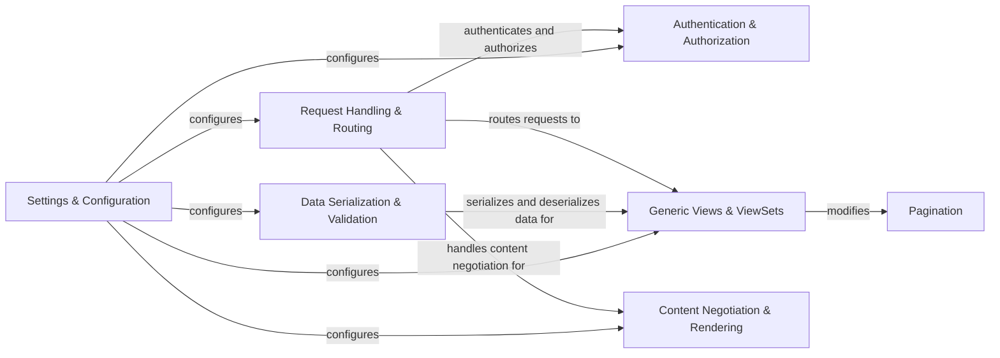

## Component Details

The Django REST Framework (DRF) is a powerful and flexible toolkit for building Web APIs. It provides a set of tools and abstractions that simplify the process of developing RESTful APIs, including request handling, serialization, authentication, and routing. DRF is designed to be highly customizable and extensible, allowing developers to tailor it to their specific needs.

### Request Handling & Routing
This component is responsible for receiving incoming HTTP requests, routing them to the appropriate view, and preparing the response. It handles tasks such as parsing request data, performing content negotiation, and applying middleware. It uses `rest_framework.request.Request` to represent the incoming request and `rest_framework.views.APIView` as the base class for views.
- **Related Classes/Methods**: `rest_framework.request.Request`, `rest_framework.views.APIView`, `rest_framework.routers`

### Authentication & Authorization
This component handles user authentication and authorization, ensuring that only authorized users can access specific resources. It supports various authentication schemes, such as Basic Authentication, Session Authentication, and Token Authentication. It uses `rest_framework.authentication` classes to authenticate users and `rest_framework.permissions` classes to authorize access to resources.
- **Related Classes/Methods**: `rest_framework.authentication`, `rest_framework.permissions`

### Data Serialization & Validation
This component handles the conversion of data between Python objects and representations like JSON. It uses serializers to define the structure of the data, perform validation, and serialize/deserialize data. It uses `rest_framework.serializers` classes to serialize and deserialize data and `rest_framework.validators` for validation.
- **Related Classes/Methods**: `rest_framework.serializers`, `rest_framework.fields`, `rest_framework.validators`

### Generic Views & ViewSets
This component provides a set of pre-built views and viewsets for common API patterns, such as creating, listing, retrieving, updating, and deleting resources. It uses `rest_framework.generics` classes to implement these views and `rest_framework.viewsets` to group related views into a single class.
- **Related Classes/Methods**: `rest_framework.generics`, `rest_framework.mixins`, `rest_framework.viewsets`

### Content Negotiation & Rendering
This component determines the appropriate content type for the request and response. It selects the appropriate parser to parse the request data and the appropriate renderer to render the response data. It uses `rest_framework.negotiation` and `rest_framework.renderers` modules.
- **Related Classes/Methods**: `rest_framework.negotiation`, `rest_framework.renderers`

### Settings & Configuration
This component manages the framework's settings, allowing customization of various aspects of the API. It uses `rest_framework.settings` module.
- **Related Classes/Methods**: `rest_framework.settings`

### Pagination
This component provides support for paginating large datasets, improving API performance and usability. It uses `rest_framework.pagination` module.
- **Related Classes/Methods**: `rest_framework.pagination`