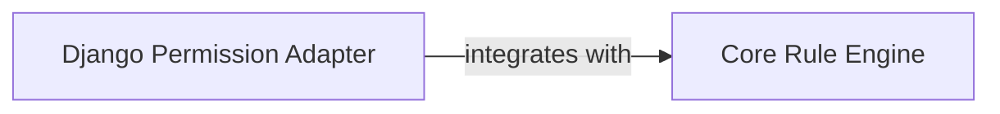

## Details

Updated analysis to include the 'Django Permission Adapter' component with its likely source file and its relationship with the 'Core Rule Engine'. Further investigation is required to pinpoint specific classes/functions and their exact line references within 'rules/permissions.py'.

### Django Permission Adapter
Handles the integration logic between Django's permission system and the core rule engine.

**Related Classes/Methods**:

- <a href="https://github.com/dfunckt/django-rules/blob/master/rules/permissions.py" target="_blank" rel="noopener noreferrer">`rules.permissions`</a>

### Core Rule Engine [[Expand]](./Core_Rule_Engine.md)
The core component responsible for defining and evaluating rules.

**Related Classes/Methods**:

- <a href="https://github.com/dfunckt/django-rules/blob/master/rules/rulesets.py" target="_blank" rel="noopener noreferrer">`rules.rulesets`</a>

### [FAQ](https://github.com/CodeBoarding/GeneratedOnBoardings/tree/main?tab=readme-ov-file#faq)