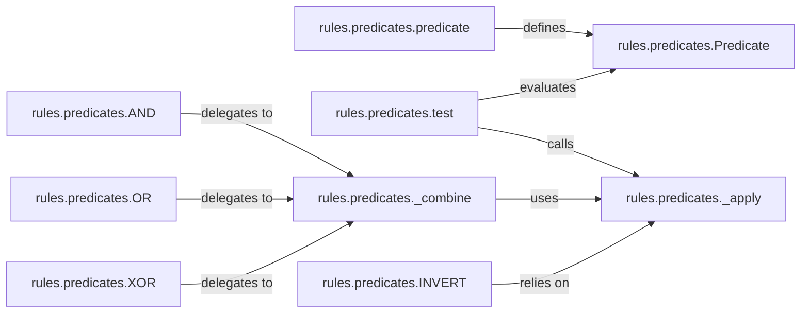

## Details

The `rules.predicates` subsystem provides a flexible and extensible framework for defining and evaluating logical conditions. At its core is the `Predicate` abstract base class, which establishes the contract for all predicate objects. The `predicate` decorator simplifies the creation of `Predicate` instances from regular functions, promoting a functional approach to rule definition. The `test` function serves as the public entry point for evaluating predicates, abstracting the internal execution details. Complex logical operations are supported through combiners like `AND`, `OR`, `XOR`, and `INVERT`, which leverage the internal `_combine` and `_apply` methods for efficient and consistent evaluation. This design promotes reusability and modularity, allowing for the construction of sophisticated rule sets from simple, composable predicates.

### rules.predicates.Predicate
The abstract base class for all predicate objects. It defines the fundamental interface and evaluation contract (`__call__`, `_apply`), serving as the primary extension point for custom predicates. It embodies the **Template Method Pattern** by deferring the actual evaluation logic to subclasses or wrapped functions, while providing a consistent evaluation mechanism.

**Related Classes/Methods**:

- <a href="https://github.com/dfunckt/django-rules/blob/master/rules/predicates.py#L242-L270" target="_blank" rel="noopener noreferrer">`rules.predicates.Predicate`:242-270</a>

### rules.predicates.predicate
A decorator/factory function that transforms regular Python functions into `Predicate` instances. This embodies the **Decorator Pattern**, allowing for easy definition of simple predicates without explicit class creation, and wrapping callable logic within the `Predicate` interface.

**Related Classes/Methods**:

- <a href="https://github.com/dfunckt/django-rules/blob/master/rules/predicates.py#L242-L270" target="_blank" rel="noopener noreferrer">`rules.predicates.predicate`:242-270</a>

### rules.predicates.test
The public entry point for evaluating any given predicate against a context. It acts as the primary interface for users to interact with the predicate evaluation logic, abstracting away the internal `_apply` mechanism.

**Related Classes/Methods**:

- <a href="https://github.com/dfunckt/django-rules/blob/master/rules/predicates.py#L164-L174" target="_blank" rel="noopener noreferrer">`rules.predicates.test`:164-174</a>

### rules.predicates._apply
An internal method of the `Predicate` class responsible for invoking the predicate's underlying callable with the correct arguments within the current invocation context. It handles argument binding and ensures consistent execution. This method is a crucial internal helper for predicate evaluation.

**Related Classes/Methods**:

- <a href="https://github.com/dfunckt/django-rules/blob/master/rules/predicates.py#L222-L239" target="_blank" rel="noopener noreferrer">`rules.predicates._apply`:222-239</a>

### rules.predicates._combine
An internal method of the `Predicate` class used by logical combiners (`AND`, `OR`, `XOR`) to evaluate and combine the results of multiple predicates. It implements short-circuiting logic for efficiency. This method is a crucial internal helper for complex predicate logic.

**Related Classes/Methods**:

- <a href="https://github.com/dfunckt/django-rules/blob/master/rules/predicates.py#L205-L220" target="_blank" rel="noopener noreferrer">`rules.predicates._combine`:205-220</a>

### rules.predicates.AND
A logical combiner that evaluates multiple predicates with an "AND" operation. It is an instance of `Predicate` that leverages `_combine` for its logic.

**Related Classes/Methods**:

- <a href="https://github.com/dfunckt/django-rules/blob/master/rules/predicates.py#L177-L178" target="_blank" rel="noopener noreferrer">`rules.predicates.AND`:177-178</a>

### rules.predicates.OR
A logical combiner that evaluates multiple predicates with an "OR" operation. It is an instance of `Predicate` that leverages `_combine` for its logic.

**Related Classes/Methods**:

- <a href="https://github.com/dfunckt/django-rules/blob/master/rules/predicates.py#L183-L184" target="_blank" rel="noopener noreferrer">`rules.predicates.OR`:183-184</a>

### rules.predicates.XOR
A logical combiner for exclusive OR operations. It is an instance of `Predicate` that leverages `_combine` for its logic.

**Related Classes/Methods**:

- <a href="https://github.com/dfunckt/django-rules/blob/master/rules/predicates.py#L189-L190" target="_blank" rel="noopener noreferrer">`rules.predicates.XOR`:189-190</a>

### rules.predicates.INVERT
A logical operator that negates the result of a single predicate. It is an instance of `Predicate` that relies on `_apply` for its evaluation and then inverts the result.

**Related Classes/Methods**:

- <a href="https://github.com/dfunckt/django-rules/blob/master/rules/predicates.py#L195-L197" target="_blank" rel="noopener noreferrer">`rules.predicates.INVERT`:195-197</a>

### [FAQ](https://github.com/CodeBoarding/GeneratedOnBoardings/tree/main?tab=readme-ov-file#faq)