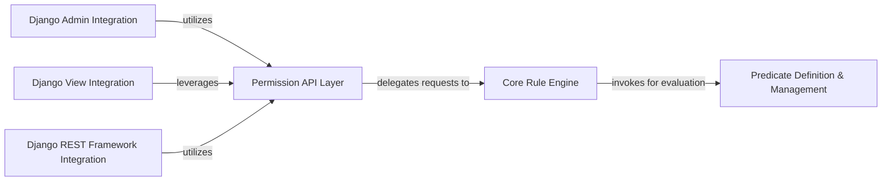

## Details

`django-rules` functions as a modular authorization framework, centered around a `Core Rule Engine` that manages and evaluates defined rules. The fundamental building blocks are `Predicates`, which represent individual logical conditions and are managed by the `Predicate Definition & Management` component. Applications interact with this system primarily through the `Permission API Layer`, which provides a high-level interface for defining and checking permissions. This API layer then delegates the actual rule evaluation to the `Core Rule Engine`. For seamless integration into Django applications, dedicated components like `Django Admin Integration`, `Django View Integration`, and `Django REST Framework Integration` leverage the `Permission API Layer` to enforce authorization logic across various parts of a Django project, ensuring a clear separation between the core rule evaluation logic and its application-specific enforcement.

### Predicate Definition & Management [[Expand]](./Predicate_Definition_Management.md)
The foundational layer responsible for defining, combining, and evaluating individual logical conditions (predicates). It provides the primitives for building complex rules.

**Related Classes/Methods**:

- <a href="https://github.com/dfunckt/django-rules/blob/master/rules/predicates.py#L164-L174" target="_blank" rel="noopener noreferrer">`rules.predicates.test`:164-174</a>
- <a href="https://github.com/dfunckt/django-rules/blob/master/rules/predicates.py#L177-L178" target="_blank" rel="noopener noreferrer">`rules.predicates.AND`:177-178</a>
- <a href="https://github.com/dfunckt/django-rules/blob/master/rules/predicates.py#L242-L270" target="_blank" rel="noopener noreferrer">`rules.predicates.predicate`:242-270</a>

### Core Rule Engine [[Expand]](./Core_Rule_Engine.md)
The central component that stores, manages, and evaluates the defined rules. It acts as the brain of the rule-based system, determining if a rule is satisfied by evaluating its constituent predicates.

**Related Classes/Methods**:

- <a href="https://github.com/dfunckt/django-rules/blob/master/rules/rulesets.py#L32-L33" target="_blank" rel="noopener noreferrer">`rules.rulesets.add_rule`:32-33</a>
- <a href="https://github.com/dfunckt/django-rules/blob/master/rules/rulesets.py#L48-L49" target="_blank" rel="noopener noreferrer">`rules.rulesets.test_rule`:48-49</a>

### Permission API Layer
Serves as the primary public interface for applications to interact with the `django-rules` system. It provides a high-level API for defining, querying, and managing permissions, abstracting direct interaction with the Core Rule Engine.

**Related Classes/Methods**:

- <a href="https://github.com/dfunckt/django-rules/blob/master/rules/permissions.py#L6-L7" target="_blank" rel="noopener noreferrer">`rules.permissions.add_perm`:6-7</a>
- <a href="https://github.com/dfunckt/django-rules/blob/master/rules/permissions.py#L30-L31" target="_blank" rel="noopener noreferrer">`rules.permissions.has_perm`:30-31</a>

### Django Admin Integration
Provides specific integration points for Django's administrative interface, enabling `django-rules` to enforce object-level and model-level permissions within the Django admin site.

**Related Classes/Methods**:

- <a href="https://github.com/dfunckt/django-rules/blob/master/rules/contrib/admin.py#L8-L15" target="_blank" rel="noopener noreferrer">`rules.contrib.admin.has_view_permission`:8-15</a>

### Django View Integration
Offers utilities and decorators to seamlessly integrate `django-rules` permission checks directly into Django views, controlling access based on defined rules.

**Related Classes/Methods**:

- <a href="https://github.com/dfunckt/django-rules/blob/master/rules/contrib/views.py#L44-L47" target="_blank" rel="noopener noreferrer">`rules.contrib.views.has_permission`:44-47</a>

### Django REST Framework Integration
Extends `django-rules` functionality to Django REST Framework, allowing for fine-grained permission control over API endpoints and resources.

**Related Classes/Methods**:

- <a href="https://github.com/dfunckt/django-rules/blob/master/rules/contrib/rest_framework.py" target="_blank" rel="noopener noreferrer">`rules.contrib.rest_framework.RulePermissions`</a>

### [FAQ](https://github.com/CodeBoarding/GeneratedOnBoardings/tree/main?tab=readme-ov-file#faq)