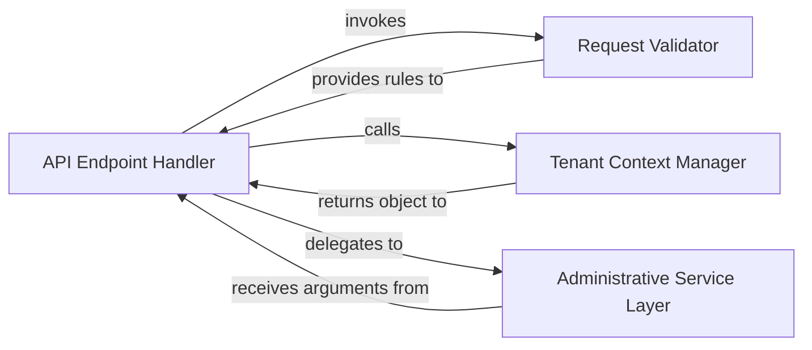

## Details

This subsystem provides a robust command-line interface for managing tenant-specific administrative tasks, analogous to a backend administrative API in a web application context. It is primarily used by system administrators to perform operations like tenant creation, data management, and executing tenant-specific commands.

### API Endpoint Handler
This component acts as the primary entry point for administrative requests, similar to a controller or API endpoint in a web application. It receives the initial command (request), orchestrates the flow, and delegates to other components for processing.

**Related Classes/Methods**:

- <a href="https://github.com/bernardopires/django-tenant-schemas/blob/master/tenant_schemas/management/commands/__init__.py#L209-L235" target="_blank" rel="noopener noreferrer">`tenant_schemas.management.commands.__init__.handle`:209-235</a>

### Request Validator
Responsible for defining and validating the input parameters for administrative commands. It ensures that incoming requests conform to expected data types and structures, preventing malformed or unauthorized operations.

**Related Classes/Methods**:

- <a href="https://github.com/bernardopires/django-tenant-schemas/blob/master/tenant_schemas/management/commands/__init__.py#L168-L207" target="_blank" rel="noopener noreferrer">`tenant_schemas.management.commands.__init__.add_arguments`:168-207</a>

### Tenant Context Manager
This component's role is to identify and establish the correct tenant context for the command being executed. It ensures that all subsequent operations are performed within the scope of the intended tenant, crucial for multi-tenant applications.

**Related Classes/Methods**:

- <a href="https://github.com/bernardopires/django-tenant-schemas/blob/master/tenant_schemas/management/commands/__init__.py#L110-L141" target="_blank" rel="noopener noreferrer">`tenant_schemas.management.commands.__init__.get_tenant_from_options_or_interactive`:110-141</a>

### Administrative Service Layer
Encapsulates the core business logic for performing administrative tasks. It receives validated parameters and the tenant context, then interacts with underlying data models and services to fulfill the command's purpose (e.g., creating a new tenant, running a specific command within a tenant's schema).

**Related Classes/Methods**:

- <a href="https://github.com/bernardopires/django-tenant-schemas/blob/master/tenant_schemas/management/commands/__init__.py#L60-L74" target="_blank" rel="noopener noreferrer">`tenant_schemas.management.commands.__init__.execute_command`:60-74</a>

### [FAQ](https://github.com/CodeBoarding/GeneratedOnBoardings/tree/main?tab=readme-ov-file#faq)