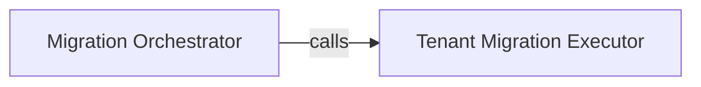

## Details

The `Migration Service` subsystem is responsible for managing and applying database migrations within a multi-tenant environment. It encompasses the logic for executing migrations on both the shared public schema and individual tenant-specific schemas, ensuring data consistency and isolation.

### Migration Orchestrator
This component acts as the central control unit for all database migration operations. It determines whether migrations should be applied to the public schema or iterated across individual tenant schemas. It orchestrates the overall migration flow, initiating and managing the execution process to ensure schema consistency across the application's database landscape.

**Related Classes/Methods**:

- <a href="https://github.com/bernardopires/django-tenant-schemas/blob/master/tenant_schemas/migration_executors/base.py#L54-L61" target="_blank" rel="noopener noreferrer">`tenant_schemas.migration_executors.base.run_migrations`:54-61</a>

### Tenant Migration Executor
This specialized component is dedicated to performing the actual database migration steps for individual tenant schemas. It receives specific instructions from the `Migration Orchestrator` and applies the necessary schema changes to a designated tenant's database or schema, ensuring proper data isolation and schema evolution for each tenant.

**Related Classes/Methods**:

- <a href="https://github.com/bernardopires/django-tenant-schemas/blob/master/tenant_schemas/migration_executors/base.py#L63-L64" target="_blank" rel="noopener noreferrer">`tenant_schemas.migration_executors.base.run_tenant_migrations`:63-64</a>

### [FAQ](https://github.com/CodeBoarding/GeneratedOnBoardings/tree/main?tab=readme-ov-file#faq)