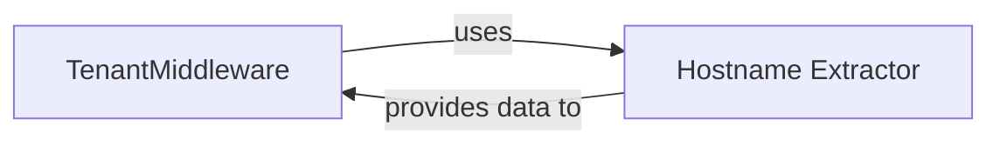

## Details

The multi-tenant system efficiently routes incoming HTTP requests to their respective tenant contexts. The `TenantTutorialMiddleware` acts as the central orchestrator, intercepting requests and leveraging the `remove_www_and_dev` utility to extract the hostname. This extracted hostname is then used to identify and set the correct tenant's database schema, ensuring that subsequent request processing operates within the appropriate tenant environment.

### TenantMiddleware
This component, implemented by `examples.tenant_tutorial.tenant_tutorial.middleware.TenantTutorialMiddleware`, serves as the primary entry point for all incoming HTTP requests in the multi-tenant architecture. It orchestrates the tenant identification flow by intercepting requests and establishing the correct tenant context (specifically, the database schema) before further processing. Its core functionality resides in the `process_request` method, which manages the tenant context switching.

**Related Classes/Methods**:

- <a href="https://github.com/bernardopires/django-tenant-schemas/blob/master/examples/tenant_tutorial/tenant_tutorial/middleware.py#L9-L32" target="_blank" rel="noopener noreferrer">`examples.tenant_tutorial.tenant_tutorial.middleware.TenantTutorialMiddleware`:9-32</a>
- <a href="https://github.com/bernardopires/django-tenant-schemas/blob/master/examples/tenant_tutorial/tenant_tutorial/middleware.py" target="_blank" rel="noopener noreferrer">`examples.tenant_tutorial.tenant_tutorial.middleware.TenantTutorialMiddleware:process_request`</a>

### Hostname Extractor
This component, represented by the `tenant_schemas.utils.remove_www_and_dev` function, is a utility responsible for parsing an incoming HTTP request to accurately extract and clean the hostname. The extracted hostname is crucial for the `TenantMiddleware` to identify the correct tenant.

**Related Classes/Methods**:

- <a href="https://github.com/bernardopires/django-tenant-schemas/blob/master/tenant_schemas/utils.py#L64-L68" target="_blank" rel="noopener noreferrer">`tenant_schemas.utils.remove_www_and_dev`:64-68</a>

### [FAQ](https://github.com/CodeBoarding/GeneratedOnBoardings/tree/main?tab=readme-ov-file#faq)