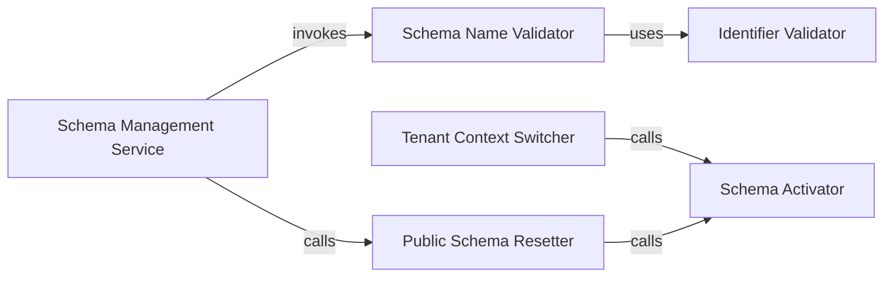

## Details

The `Schema Management Service` subsystem is primarily defined by the functionalities within `tenant_schemas.postgresql_backend.base.py`. It encompasses the core logic for managing and switching database schemas to ensure data isolation in a multi-tenant environment.

### Schema Management Service [[Expand]](./Schema_Management_Service.md)
The overarching component responsible for orchestrating schema management operations. It ensures the correct schema is active for database interactions and integrates various sub-components to maintain data isolation and integrity. In a web application, this is the central point for managing tenant-specific database contexts.

**Related Classes/Methods**:

- <a href="https://github.com/bernardopires/django-tenant-schemas/blob/master/tenant_schemas/postgresql_backend/base.py" target="_blank" rel="noopener noreferrer">`tenant_schemas.postgresql_backend.base`</a>

### Schema Activator
Directly executes SQL commands to change the active database schema, ensuring data isolation at the database level. It also updates Django's internal settings to reflect the current schema context. This is a critical low-level component for runtime tenant switching in a web application.

**Related Classes/Methods**:

- <a href="https://github.com/bernardopires/django-tenant-schemas/blob/master/tenant_schemas/postgresql_backend/base.py" target="_blank" rel="noopener noreferrer">`tenant_schemas.postgresql_backend.base:set_schema`</a>

### Tenant Context Switcher
Provides a high-level abstraction for switching schemas based on a tenant object, delegating the actual schema change to the `Schema Activator`. In a web application, this serves as the primary interface for application logic to switch between tenant contexts, ensuring requests operate on the correct tenant's data.

**Related Classes/Methods**:

- <a href="https://github.com/bernardopires/django-tenant-schemas/blob/master/tenant_schemas/postgresql_backend/base.py" target="_blank" rel="noopener noreferrer">`tenant_schemas.postgresql_backend.base:set_tenant`</a>

### Public Schema Resetter
Offers a dedicated mechanism to revert the database connection to the default public schema, ensuring a clean state. This is vital for operations that need to interact with shared, non-tenant-specific data or for resetting the connection state after a tenant-specific operation in a web application.

**Related Classes/Methods**:

- <a href="https://github.com/bernardopires/django-tenant-schemas/blob/master/tenant_schemas/postgresql_backend/base.py" target="_blank" rel="noopener noreferrer">`tenant_schemas.postgresql_backend.base:set_schema_to_public`</a>

### Schema Name Validator
Enforces naming conventions and security for schema names before they are used in database operations. This prevents SQL injection and ensures valid identifiers, acting as a critical security and data integrity gate for any web application handling dynamic schema names.

**Related Classes/Methods**:

- <a href="https://github.com/bernardopires/django-tenant-schemas/blob/master/tenant_schemas/postgresql_backend/base.py" target="_blank" rel="noopener noreferrer">`tenant_schemas.postgresql_backend.base:_check_schema_name`</a>

### Identifier Validator
A foundational utility that validates general database identifiers against PostgreSQL naming rules, ensuring data integrity and security. This component supports the `Schema Name Validator` by providing a lower-level validation primitive, crucial for maintaining database health in a multi-tenant environment.

**Related Classes/Methods**:

- <a href="https://github.com/bernardopires/django-tenant-schemas/blob/master/tenant_schemas/postgresql_backend/base.py" target="_blank" rel="noopener noreferrer">`tenant_schemas.postgresql_backend.base`</a>

### [FAQ](https://github.com/CodeBoarding/GeneratedOnBoardings/tree/main?tab=readme-ov-file#faq)