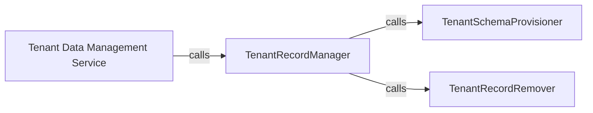

## Details

The `tenant_schemas` subsystem is designed around managing multi-tenant database schemas. The `Tenant Data Management Service` acts as the central entry point for all tenant-related operations. It delegates the core responsibilities to `TenantRecordManager`, which handles the persistence and lifecycle of tenant records. `TenantRecordManager` further interacts with `TenantSchemaProvisioner` for creating new schemas during tenant onboarding and `TenantRecordRemover` for dropping schemas during tenant offboarding. This modular design ensures a clear separation of concerns, with each component focusing on a specific aspect of tenant data and schema management.

### Tenant Data Management Service [[Expand]](./Tenant_Data_Management_Service.md)
This is the primary facade and orchestrator for all tenant-related business logic. It provides a high-level interface for external components to interact with tenant records and their associated schemas. It encapsulates the overall workflow for tenant onboarding and offboarding.

**Related Classes/Methods**:

- <a href="https://github.com/bernardopires/django-tenant-schemas/blob/master/tenant_schemas/models.py" target="_blank" rel="noopener noreferrer">`tenant_schemas.models.TenantMixin:save`</a>
- <a href="https://github.com/bernardopires/django-tenant-schemas/blob/master/tenant_schemas/models.py" target="_blank" rel="noopener noreferrer">`tenant_schemas.models.TenantMixin:delete`</a>
- <a href="https://github.com/bernardopires/django-tenant-schemas/blob/master/tenant_schemas/models.py" target="_blank" rel="noopener noreferrer">`tenant_schemas.models.TenantMixin:create_schema`</a>

### TenantRecordManager
Manages the lifecycle and persistence of tenant records within the system. It acts as the central orchestrator for core tenant data operations, delegating specific tasks like schema provisioning and record removal to specialized components.

**Related Classes/Methods**:

- <a href="https://github.com/bernardopires/django-tenant-schemas/blob/master/tenant_schemas/models.py" target="_blank" rel="noopener noreferrer">`tenant_schemas.models.TenantMixin:save`</a>

### TenantSchemaProvisioner
Responsible for the physical creation and setup of database schemas for new tenants. This component handles the critical infrastructure provisioning aspect of tenant onboarding.

**Related Classes/Methods**:

- <a href="https://github.com/bernardopires/django-tenant-schemas/blob/master/tenant_schemas/models.py" target="_blank" rel="noopener noreferrer">`tenant_schemas.models.TenantMixin:create_schema`</a>

### TenantRecordRemover
Manages the secure and complete deletion of tenant records and ensures the deallocation of all associated resources, including potentially dropping database schemas.

**Related Classes/Methods**:

- <a href="https://github.com/bernardopires/django-tenant-schemas/blob/master/tenant_schemas/models.py" target="_blank" rel="noopener noreferrer">`tenant_schemas.models.TenantMixin:delete`</a>

### [FAQ](https://github.com/CodeBoarding/GeneratedOnBoardings/tree/main?tab=readme-ov-file#faq)