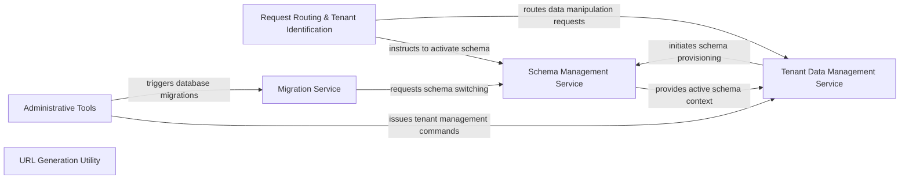

## Details

The `django-tenant-schemas` architecture is designed to provide robust multi-tenancy by dynamically managing database schemas. At its core, the Request Routing & Tenant Identification component intercepts incoming requests to determine the active tenant, subsequently instructing the Schema Management Service to switch to the correct database schema. This ensures that all application logic, primarily handled by the Tenant Data Management Service for tenant-specific data operations, operates within an isolated data context. Administrative tasks, facilitated by the Administrative Tools, interact with the Tenant Data Management Service for tenant lifecycle management and trigger the Migration Service to apply schema changes across all tenants, with the Schema Management Service orchestrating the schema switching during migrations. The URL Generation Utility supports tenant-aware URL creation, completing the multi-tenant application ecosystem. This modular design emphasizes clear separation of concerns, making it suitable for scalable web applications requiring strong data isolation.

### Request Routing & Tenant Identification [[Expand]](./Request_Routing_Tenant_Identification.md)
Serves as the primary entry point for all incoming HTTP requests, responsible for identifying the current tenant and routing requests to the appropriate database schema. It also ensures that subsequent database operations are correctly scoped to the identified tenant.

**Related Classes/Methods**:

- <a href="https://github.com/bernardopires/django-tenant-schemas/blob/master/tenant_schemas/middleware.py#L42-L71" target="_blank" rel="noopener noreferrer">`tenant_schemas.middleware.process_request`:42-71</a>
- <a href="https://github.com/bernardopires/django-tenant-schemas/blob/master/tenant_schemas/middleware.py#L112-L122" target="_blank" rel="noopener noreferrer">`tenant_schemas.middleware.get_tenant`:112-122</a>
- <a href="https://github.com/bernardopires/django-tenant-schemas/blob/master/tenant_schemas/middleware.py#L36-L40" target="_blank" rel="noopener noreferrer">`tenant_schemas.middleware.hostname_from_request`:36-40</a>
- <a href="https://github.com/bernardopires/django-tenant-schemas/blob/master/tenant_schemas/routers.py#L37-L39" target="_blank" rel="noopener noreferrer">`tenant_schemas.routers.allow_syncdb`:37-39</a>
- <a href="https://github.com/bernardopires/django-tenant-schemas/blob/master/tenant_schemas/routers.py#L12-L35" target="_blank" rel="noopener noreferrer">`tenant_schemas.routers.allow_migrate`:12-35</a>

### Schema Management Service [[Expand]](./Schema_Management_Service.md)
The central authority for managing and switching database schemas. It handles the activation of public or tenant-specific schemas and validates schema names, ensuring strict data isolation between tenants.

**Related Classes/Methods**:

- <a href="https://github.com/bernardopires/django-tenant-schemas/blob/master/tenant_schemas/postgresql_backend/base.py#L74-L91" target="_blank" rel="noopener noreferrer">`tenant_schemas.postgresql_backend.base.set_schema`:74-91</a>
- <a href="https://github.com/bernardopires/django-tenant-schemas/blob/master/tenant_schemas/postgresql_backend/base.py#L66-L72" target="_blank" rel="noopener noreferrer">`tenant_schemas.postgresql_backend.base.set_tenant`:66-72</a>
- <a href="https://github.com/bernardopires/django-tenant-schemas/blob/master/tenant_schemas/postgresql_backend/base.py#L93-L97" target="_blank" rel="noopener noreferrer">`tenant_schemas.postgresql_backend.base.set_schema_to_public`:93-97</a>
- <a href="https://github.com/bernardopires/django-tenant-schemas/blob/master/tenant_schemas/postgresql_backend/base.py#L38-L40" target="_blank" rel="noopener noreferrer">`tenant_schemas.postgresql_backend.base._check_schema_name`:38-40</a>

### Tenant Data Management Service [[Expand]](./Tenant_Data_Management_Service.md)
Encapsulates the business logic for creating, saving, and deleting tenant records. A key responsibility is orchestrating the physical schema creation process when a new tenant is onboarded.

**Related Classes/Methods**:

- <a href="https://github.com/bernardopires/django-tenant-schemas/blob/master/tenant_schemas/models.py#L56-L78" target="_blank" rel="noopener noreferrer">`tenant_schemas.models.save`:56-78</a>
- <a href="https://github.com/bernardopires/django-tenant-schemas/blob/master/tenant_schemas/models.py#L80-L94" target="_blank" rel="noopener noreferrer">`tenant_schemas.models.delete`:80-94</a>
- <a href="https://github.com/bernardopires/django-tenant-schemas/blob/master/tenant_schemas/models.py#L96-L120" target="_blank" rel="noopener noreferrer">`tenant_schemas.models.create_schema`:96-120</a>

### Migration Service [[Expand]](./Migration_Service.md)
Responsible for applying database migrations across different schemas. It can execute migrations on the public schema or iterate through all active tenants to apply migrations to each tenant's dedicated schema, ensuring schema consistency.

**Related Classes/Methods**:

- <a href="https://github.com/bernardopires/django-tenant-schemas/blob/master/tenant_schemas/migration_executors/base.py#L54-L61" target="_blank" rel="noopener noreferrer">`tenant_schemas.migration_executors.base.run_migrations`:54-61</a>
- <a href="https://github.com/bernardopires/django-tenant-schemas/blob/master/tenant_schemas/migration_executors/base.py#L63-L64" target="_blank" rel="noopener noreferrer">`tenant_schemas.migration_executors.base.run_tenant_migrations`:63-64</a>

### Administrative Tools [[Expand]](./Administrative_Tools.md)
Provides a command-line interface for administrative tasks related to tenants. This includes creating new tenants, running tenant-specific commands, and managing tenant data, primarily used by system administrators.

**Related Classes/Methods**:

- <a href="https://github.com/bernardopires/django-tenant-schemas/blob/master/tenant_schemas/management/commands/__init__.py#L209-L235" target="_blank" rel="noopener noreferrer">`tenant_schemas.management.commands.__init__.handle`:209-235</a>
- <a href="https://github.com/bernardopires/django-tenant-schemas/blob/master/tenant_schemas/management/commands/__init__.py#L168-L207" target="_blank" rel="noopener noreferrer">`tenant_schemas.management.commands.__init__.add_arguments`:168-207</a>
- <a href="https://github.com/bernardopires/django-tenant-schemas/blob/master/tenant_schemas/management/commands/__init__.py#L60-L74" target="_blank" rel="noopener noreferrer">`tenant_schemas.management.commands.__init__.execute_command`:60-74</a>

### URL Generation Utility
A utility component designed to assist in generating tenant-aware URLs within Django templates. It ensures that all generated links correctly point to the current tenant's domain or path, maintaining context across the application.

**Related Classes/Methods**:

- <a href="https://github.com/bernardopires/django-tenant-schemas/blob/master/tenant_schemas/templatetags/tenant.py#L17-L19" target="_blank" rel="noopener noreferrer">`tenant_schemas.templatetags.tenant.url`:17-19</a>
- <a href="https://github.com/bernardopires/django-tenant-schemas/blob/master/tenant_schemas/templatetags/tenant.py#L8-L14" target="_blank" rel="noopener noreferrer">`tenant_schemas.templatetags.tenant.SchemaURLNode`:8-14</a>

### [FAQ](https://github.com/CodeBoarding/GeneratedOnBoardings/tree/main?tab=readme-ov-file#faq)