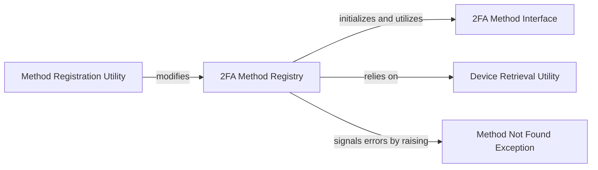

## Details

The `2FA Method Registry` subsystem is primarily encapsulated within the `two_factor.plugins.registry` module. This module defines the core mechanisms for registering, managing, and accessing various Two-Factor Authentication (2FA) methods within the `django-two-factor-auth` project.

### 2FA Method Registry [[Expand]](./2FA_Method_Registry.md)
This is the central component of the subsystem, acting as a service locator and repository for all available 2FA methods. It implements the Extension/Plugin Pattern, allowing new authentication methods to be dynamically registered and discovered. It provides the core mechanism for the `django-two-factor-auth` system to be extensible.

**Related Classes/Methods**:

- <a href="https://github.com/jazzband/django-two-factor-auth/blob/master/two_factor/plugins/registry.py#L1-L1000" target="_blank" rel="noopener noreferrer">`two_factor.plugins.registry`:1-1000</a>

### Method Registration Utility
This component is a function or decorator responsible for adding new 2FA methods to the central `2FA Method Registry`. It serves as the primary entry point for extending the system with custom or third-party 2FA methods, ensuring they become discoverable and usable.

**Related Classes/Methods**:

- <a href="https://github.com/jazzband/django-two-factor-auth/blob/master/two_factor/plugins/registry.py#L88-L93" target="_blank" rel="noopener noreferrer">`two_factor.plugins.registry.register`:88-93</a>

### 2FA Method Interface
This component defines an abstract base class or interface that outlines the contract for all 2FA method objects. It specifies the required methods and properties that any concrete 2FA method implementation must adhere to, ensuring consistency and interoperability within the registry.

**Related Classes/Methods**:

- <a href="https://github.com/jazzband/django-two-factor-auth/blob/master/two_factor/plugins/registry.py#L62-L79" target="_blank" rel="noopener noreferrer">`two_factor.plugins.registry.GeneratorMethod`:62-79</a>

### Device Retrieval Utility
A utility function within the registry module responsible for retrieving a user's currently registered 2FA devices. This component provides the necessary functionality to query and present the authentication options available to a specific user.

**Related Classes/Methods**:

- <a href="https://github.com/jazzband/django-two-factor-auth/blob/master/two_factor/plugins/registry.py#L67-L68" target="_blank" rel="noopener noreferrer">`two_factor.plugins.registry.get_devices`:67-68</a>

### Method Not Found Exception
A custom exception class specifically designed to be raised when a requested 2FA method cannot be located within the `2FA Method Registry`. This provides clear error handling and feedback when an invalid or unregistered method is requested.

**Related Classes/Methods**:

- <a href="https://github.com/jazzband/django-two-factor-auth/blob/master/two_factor/plugins/registry.py#L4-L10" target="_blank" rel="noopener noreferrer">`two_factor.plugins.registry.MethodNotFoundError`:4-10</a>

### [FAQ](https://github.com/CodeBoarding/GeneratedOnBoardings/tree/main?tab=readme-ov-file#faq)