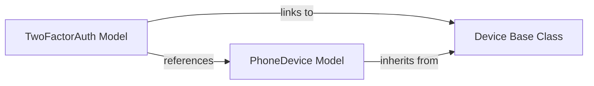

## Details

The two-factor authentication subsystem is structured around a central TwoFactorAuth model (two_factor.models.TwoFactorAuth) that orchestrates a user's 2FA settings. This model interacts with a hierarchy of OTP device implementations, all stemming from the abstract Device base class (django_otp.models.Device). Concrete device types, such as the PhoneDevice (two_factor.plugins.phonenumber.models.PhoneDevice), extend this base class to provide specific authentication mechanisms like SMS-based OTP. This design allows for flexible integration of various 2FA methods while maintaining a consistent interface for managing user authentication.

### TwoFactorAuth Model
Manages a user's 2FA configuration.

**Related Classes/Methods**:

### Device Base Class
Abstract base class, defining the common interface for all OTP devices.

**Related Classes/Methods**:

### PhoneDevice Model
Extends the Device base class to provide specific authentication methods (e.g., SMS-based OTP).

**Related Classes/Methods**:

- <a href="https://github.com/jazzband/django-two-factor-auth/blob/master/two_factor/plugins/phonenumber/models.py#L24-L101" target="_blank" rel="noopener noreferrer">`two_factor.plugins.phonenumber.models.PhoneDevice`:24-101</a>

### [FAQ](https://github.com/CodeBoarding/GeneratedOnBoardings/tree/main?tab=readme-ov-file#faq)