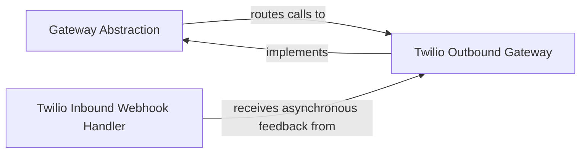

## Details

The `two_factor` authentication communication subsystem is built around a `Gateway Abstraction` that defines a consistent interface for sending SMS and making voice calls, crucial for decoupling the application from specific communication providers. The `Twilio Outbound Gateway` serves as a concrete implementation of this abstraction, managing all interactions with the Twilio API for outbound communications. The system dynamically selects and utilizes the appropriate gateway through a factory mechanism within the `Gateway Abstraction`. Complementing this, the `Twilio Inbound Webhook Handler` processes asynchronous feedback from Twilio, such as delivery reports or call status updates, enabling the system to react to external communication events.

### Gateway Abstraction
This component defines the abstract interface for sending SMS messages and making voice calls for 2FA challenges. It also acts as a factory, providing a mechanism to retrieve the currently configured concrete gateway implementation. This ensures that the rest of the application interacts with a consistent communication interface, decoupling it from specific service providers.

**Related Classes/Methods**:

- <a href="https://github.com/jazzband/django-two-factor-auth/blob/master/two_factor/gateways/__init__.py" target="_blank" rel="noopener noreferrer">`two_factor.gateways.send_sms`</a>
- <a href="https://github.com/jazzband/django-two-factor-auth/blob/master/two_factor/gateways/__init__.py" target="_blank" rel="noopener noreferrer">`two_factor.gateways.make_call`</a>
- <a href="https://github.com/jazzband/django-two-factor-auth/blob/master/two_factor/gateways/__init__.py" target="_blank" rel="noopener noreferrer">`two_factor.gateways.get_gateway_class`</a>

### Twilio Outbound Gateway
This component is a concrete implementation of the `Gateway Abstraction`, specifically designed to handle the logic for sending SMS and making voice calls via the Twilio API. It encapsulates all the details of interacting with the Twilio service for outbound communication, including API calls, authentication, and error handling.

**Related Classes/Methods**:

- <a href="https://github.com/jazzband/django-two-factor-auth/blob/master/two_factor/gateways/twilio/gateway.py#L61-L79" target="_blank" rel="noopener noreferrer">`two_factor.gateways.twilio.gateway.send_sms`:61-79</a>
- <a href="https://github.com/jazzband/django-two-factor-auth/blob/master/two_factor/gateways/twilio/gateway.py#L49-L59" target="_blank" rel="noopener noreferrer">`two_factor.gateways.twilio.gateway.make_call`:49-59</a>

### Twilio Inbound Webhook Handler
This is a Django-specific view component responsible for processing incoming webhook requests from Twilio. It handles asynchronous feedback from Twilio, such as SMS status updates or responses to voice calls. It generates appropriate TwiML (Twilio Markup Language) responses to guide Twilio's behavior, making it crucial for managing the asynchronous communication flow.

**Related Classes/Methods**:

- <a href="https://github.com/jazzband/django-two-factor-auth/blob/master/two_factor/gateways/twilio/views.py" target="_blank" rel="noopener noreferrer">`two_factor.gateways.twilio.views`</a>

### [FAQ](https://github.com/CodeBoarding/GeneratedOnBoardings/tree/main?tab=readme-ov-file#faq)