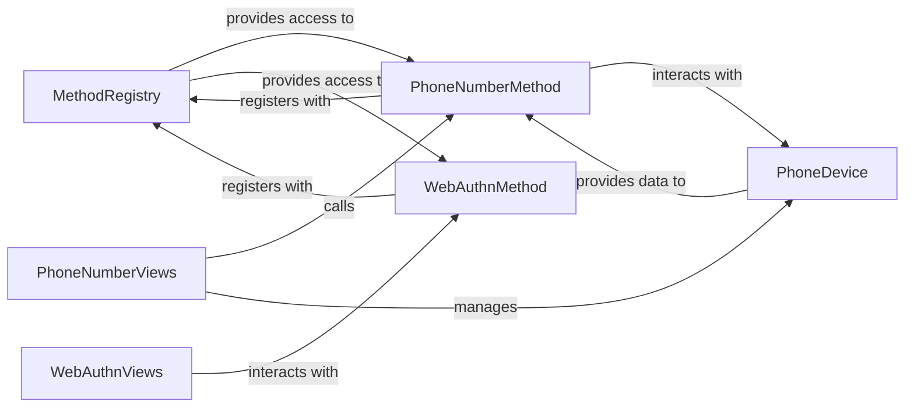

## Details

The `django-two-factor-auth` project employs a pluggable architecture centered around the `MethodRegistry`, which acts as a central hub for discovering and managing various two-factor authentication methods. Concrete implementations like `PhoneNumberMethod` and `WebAuthnMethod` register themselves with this registry, allowing the system to dynamically support different authentication mechanisms. User interaction is handled by dedicated Django Views, such as `PhoneNumberViews` and `WebAuthnViews`, which orchestrate the authentication flow by interacting with their respective method components. Persistent storage for user-specific 2FA configurations, like registered phone numbers, is managed by Django Models such as `PhoneDevice`. This design promotes extensibility and modularity, enabling easy integration of new 2FA methods.

### MethodRegistry
This component serves as the central registration and discovery mechanism for all available 2FA methods. It allows different `Method` implementations to register themselves, making them accessible and manageable throughout the application. This is fundamental to the "Extension/Plugin Pattern" of the project.

**Related Classes/Methods**:

- <a href="https://github.com/jazzband/django-two-factor-auth/blob/master/two_factor/plugins/registry.py#L82-L112" target="_blank" rel="noopener noreferrer">`MethodRegistry`:82-112</a>

### PhoneNumberMethod
Encapsulates the core business logic for phone-based two-factor authentication. This includes generating and sending one-time passwords (OTPs) to a user's registered phone number and verifying the correctness of the entered OTPs. It represents a concrete implementation of a pluggable 2FA method.

**Related Classes/Methods**:

- <a href="https://github.com/jazzband/django-two-factor-auth/blob/master/two_factor/plugins/phonenumber/forms.py#L9-L27" target="_blank" rel="noopener noreferrer">`PhoneNumberMethod`:9-27</a>

### PhoneNumberViews
Handles the user interface and interaction flow for phone-based 2FA. This includes views for setting up a new phone device, verifying OTPs during the login process, and managing existing phone devices. It adheres to Django's MVT pattern for presenting the user interface.

**Related Classes/Methods**:

- <a href="https://github.com/jazzband/django-two-factor-auth/blob/master/two_factor/plugins/phonenumber/views.py#L1-L9999" target="_blank" rel="noopener noreferrer">`PhoneNumberViews`:1-9999</a>

### PhoneDevice
A Django Model that represents a registered phone device for a user. It stores essential data such as the phone number and other metadata required for phone-based 2FA. This component is crucial for persisting user-specific 2FA configurations.

**Related Classes/Methods**:

- <a href="https://github.com/jazzband/django-two-factor-auth/blob/master/two_factor/migrations/0003_auto_20150817_1733.py" target="_blank" rel="noopener noreferrer">`PhoneDevice`</a>

### WebAuthnMethod
Encapsulates the core business logic for WebAuthn-based two-factor authentication. This involves generating WebAuthn challenges for the client, processing the client's WebAuthn responses, and verifying the authenticity of the WebAuthn credentials. It is another concrete implementation of a pluggable 2FA method.

**Related Classes/Methods**:

- <a href="https://github.com/jazzband/django-two-factor-auth/blob/master/two_factor/plugins/webauthn/method.py#L12-L65" target="_blank" rel="noopener noreferrer">`WebAuthnMethod`:12-65</a>

### WebAuthnViews
Manages the user interface and interaction flow for WebAuthn 2FA. This includes views for registering new WebAuthn devices and handling the authentication challenges presented to the user's browser. It follows Django's MVT pattern for UI presentation.

**Related Classes/Methods**:

- <a href="https://github.com/jazzband/django-two-factor-auth/blob/master/two_factor/plugins/webauthn/views.py#L1-L9999" target="_blank" rel="noopener noreferrer">`WebAuthnViews`:1-9999</a>

### [FAQ](https://github.com/CodeBoarding/GeneratedOnBoardings/tree/main?tab=readme-ov-file#faq)