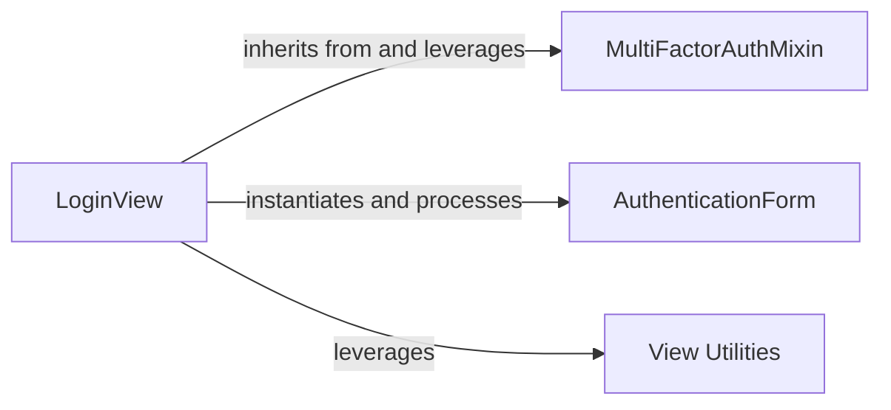

## Details

The `Two-Factor Authentication Core` subsystem is designed as a seamless extension to Django's authentication system, adhering to the Web Framework Extension/Library pattern. It centralizes the multi-step 2FA flow, integrating directly with `django.contrib.auth`.

### LoginView
Acts as the central orchestrator and primary controller for the 2FA user experience. It manages the entire multi-step 2FA login process, including initial user authentication, determining the required 2FA step, rendering appropriate forms, processing user input, and managing session state throughout the authentication flow. It directly integrates with Django's core authentication (`django.contrib.auth`).

**Related Classes/Methods**:

- <a href="https://github.com/jazzband/django-two-factor-auth/blob/master/two_factor/views/core.py#L71-L426" target="_blank" rel="noopener noreferrer">`two_factor.views.core.LoginView`:71-426</a>

### MultiFactorAuthMixin
Provides foundational, reusable logic for handling multi-factor authentication within Django views. This includes methods for dispatching requests, determining redirection URLs based on authentication status, and managing the overall flow state. It abstracts common 2FA behaviors, promoting code reuse across different 2FA-related views.

**Related Classes/Methods**:

- <a href="https://github.com/jazzband/django-two-factor-auth/blob/master/two_factor/views/mixins.py" target="_blank" rel="noopener noreferrer">`two_factor.views.mixins.MultiFactorAuthMixin`</a>

### AuthenticationForm
Defines the structure and validation rules for user input during the 2FA process. This includes handling the initial username/password submission and subsequent token validation for various 2FA methods. It ensures data integrity and adherence to security policies.

**Related Classes/Methods**:

- <a href="https://github.com/jazzband/django-two-factor-auth/blob/master/two_factor/forms.py" target="_blank" rel="noopener noreferrer">`two_factor.forms.AuthenticationForm`</a>

### View Utilities
Offers a collection of stateless helper functions that support the core views. This includes functionalities like securely resetting authentication data in sessions, managing the visibility and progression of authentication steps, and handling "remember device" cookies to enhance user experience and security.

**Related Classes/Methods**:

- <a href="https://github.com/jazzband/django-two-factor-auth/blob/master/two_factor/views/utils.py" target="_blank" rel="noopener noreferrer">`two_factor.views.utils`</a>

### [FAQ](https://github.com/CodeBoarding/GeneratedOnBoardings/tree/main?tab=readme-ov-file#faq)