```mermaid
graph LR
    Two_Factor_Authentication_Core["Two-Factor Authentication Core"]
    2FA_Method_Registry["2FA Method Registry"]
    Pluggable_2FA_Methods["Pluggable 2FA Methods"]
    External_Communication_Gateway["External Communication Gateway"]
    Django_OTP_Data_Layer["Django OTP & Data Layer"]
    Django_Authentication_System["Django Authentication System"]
    Django_Authentication_System -- "delegates authentication requests to" --> Two_Factor_Authentication_Core
    Two_Factor_Authentication_Core -- "queries" --> 2FA_Method_Registry
    2FA_Method_Registry -- "dispatches control to" --> Pluggable_2FA_Methods
    Pluggable_2FA_Methods -- "requests challenge delivery through" --> External_Communication_Gateway
    Pluggable_2FA_Methods -- "interacts with" --> Django_OTP_Data_Layer
    Two_Factor_Authentication_Core -- "retrieves and updates 2FA device information and state via" --> Django_OTP_Data_Layer
    Two_Factor_Authentication_Core -- "signals" --> Django_Authentication_System
    click Two_Factor_Authentication_Core href "https://github.com/CodeBoarding/GeneratedOnBoardings/blob/main/django-two-factor-auth/Two_Factor_Authentication_Core.md" "Details"
    click 2FA_Method_Registry href "https://github.com/CodeBoarding/GeneratedOnBoardings/blob/main/django-two-factor-auth/2FA_Method_Registry.md" "Details"
    click Pluggable_2FA_Methods href "https://github.com/CodeBoarding/GeneratedOnBoardings/blob/main/django-two-factor-auth/Pluggable_2FA_Methods.md" "Details"
    click External_Communication_Gateway href "https://github.com/CodeBoarding/GeneratedOnBoardings/blob/main/django-two-factor-auth/External_Communication_Gateway.md" "Details"
    click Django_OTP_Data_Layer href "https://github.com/CodeBoarding/GeneratedOnBoardings/blob/main/django-two-factor-auth/Django_OTP_Data_Layer.md" "Details"
    click Django_Authentication_System href "https://github.com/CodeBoarding/GeneratedOnBoardings/blob/main/django-two-factor-auth/Django_Authentication_System.md" "Details"
```

## Details

The `django-two-factor-auth` project provides a robust, pluggable two-factor authentication system for Django applications. At its core, the Two-Factor Authentication Core orchestrates the entire 2FA flow, managing user interactions and session state. It dynamically interacts with the 2FA Method Registry, which acts as an extensible lookup service for various Pluggable 2FA Methods (e.g., Phone, WebAuthn). These methods encapsulate the specific logic for generating and verifying authentication challenges. For external communication, such as sending SMS or making calls, the system utilizes the External Communication Gateway, which provides an abstract interface for different concrete implementations. All 2FA device management and data persistence are handled by the Django OTP & Data Layer, which integrates with the `django-otp` library and manages related data models. Finally, the entire system seamlessly integrates with the Django Authentication System, extending its core functionalities for user authentication and session management.

### Two-Factor Authentication Core [[Expand]](./Two_Factor_Authentication_Core.md)
The central orchestrator of the multi-step 2FA authentication flow. It manages user sessions, input, redirects, and coordinates with various 2FA methods, integrating directly with Django's core authentication.

**Related Classes/Methods**:

- <a href="https://github.com/jazzband/django-two-factor-auth/blob/master/two_factor/views/core.py" target="_blank" rel="noopener noreferrer">`two_factor/views/core.py`</a>
- <a href="https://github.com/jazzband/django-two-factor-auth/blob/master/two_factor/views/mixins.py" target="_blank" rel="noopener noreferrer">`two_factor/views/mixins.py`</a>
- <a href="https://github.com/jazzband/django-two-factor-auth/blob/master/two_factor/views/utils.py" target="_blank" rel="noopener noreferrer">`two_factor/views/utils.py`</a>
- <a href="https://github.com/jazzband/django-two-factor-auth/blob/master/two_factor/forms.py" target="_blank" rel="noopener noreferrer">`two_factor/forms.py`</a>

### 2FA Method Registry [[Expand]](./2FA_Method_Registry.md)
Implements a plugin-like system for registering and providing access to different 2FA methods. It acts as a central lookup service, enabling extensibility for new authentication methods.

**Related Classes/Methods**:

- <a href="https://github.com/jazzband/django-two-factor-auth/blob/master/two_factor/plugins/registry.py" target="_blank" rel="noopener noreferrer">`two_factor/plugins/registry.py`</a>

### Pluggable 2FA Methods [[Expand]](./Pluggable_2FA_Methods.md)
Represents the various concrete 2FA implementations (e.g., Phone, WebAuthn). Each method encapsulates the specific logic for generating, sending, and verifying its respective authentication challenge.

**Related Classes/Methods**:

- <a href="https://github.com/jazzband/django-two-factor-auth/blob/master/two_factor/plugins/phonenumber/method.py" target="_blank" rel="noopener noreferrer">`two_factor/plugins/phonenumber/method.py`</a>
- <a href="https://github.com/jazzband/django-two-factor-auth/blob/master/two_factor/plugins/phonenumber/views.py" target="_blank" rel="noopener noreferrer">`two_factor/plugins/phonenumber/views.py`</a>
- <a href="https://github.com/jazzband/django-two-factor-auth/blob/master/two_factor/plugins/webauthn/method.py" target="_blank" rel="noopener noreferrer">`two_factor/plugins/webauthn/method.py`</a>
- <a href="https://github.com/jazzband/django-two-factor-auth/blob/master/two_factor/plugins/webauthn/views.py" target="_blank" rel="noopener noreferrer">`two_factor/plugins/webauthn/views.py`</a>

### External Communication Gateway [[Expand]](./External_Communication_Gateway.md)
Defines the abstract interface for external communication, primarily for sending SMS messages or making voice calls for 2FA challenges. It allows for different concrete gateway implementations.

**Related Classes/Methods**:

- <a href="https://github.com/jazzband/django-two-factor-auth/blob/master/two_factor/gateways/__init__.py" target="_blank" rel="noopener noreferrer">`two_factor/gateways/__init__.py`</a>
- <a href="https://github.com/jazzband/django-two-factor-auth/blob/master/two_factor/gateways/twilio/gateway.py" target="_blank" rel="noopener noreferrer">`two_factor/gateways/twilio/gateway.py`</a>

### Django OTP & Data Layer [[Expand]](./Django_OTP_Data_Layer.md)
Manages OTP devices and integrates with the `django-otp` library, which provides the core framework for OTP device management and verification. This component also handles the persistence of 2FA-related data models.

**Related Classes/Methods**:

- <a href="https://github.com/jazzband/django-two-factor-auth/blob/master/two_factor/models.py" target="_blank" rel="noopener noreferrer">`two_factor.models`</a>
- <a href="https://github.com/jazzband/django-two-factor-auth/blob/master/two_factor/plugins/phonenumber/models.py" target="_blank" rel="noopener noreferrer">`two_factor/plugins/phonenumber/models.py`</a>
- <a href="https://github.com/jazzband/django-two-factor-auth/blob/master/" target="_blank" rel="noopener noreferrer">`django_otp.models`</a>

### Django Authentication System [[Expand]](./Django_Authentication_System.md)
Represents the interaction with Django's built-in authentication system, including user context, session management, and the user model. `django-two-factor-auth` extends and integrates with this core Django functionality.

**Related Classes/Methods**:

- <a href="https://github.com/jazzband/django-two-factor-auth/blob/master/" target="_blank" rel="noopener noreferrer">`django.contrib.auth.models`</a>

### [FAQ](https://github.com/CodeBoarding/GeneratedOnBoardings/tree/main?tab=readme-ov-file#faq)