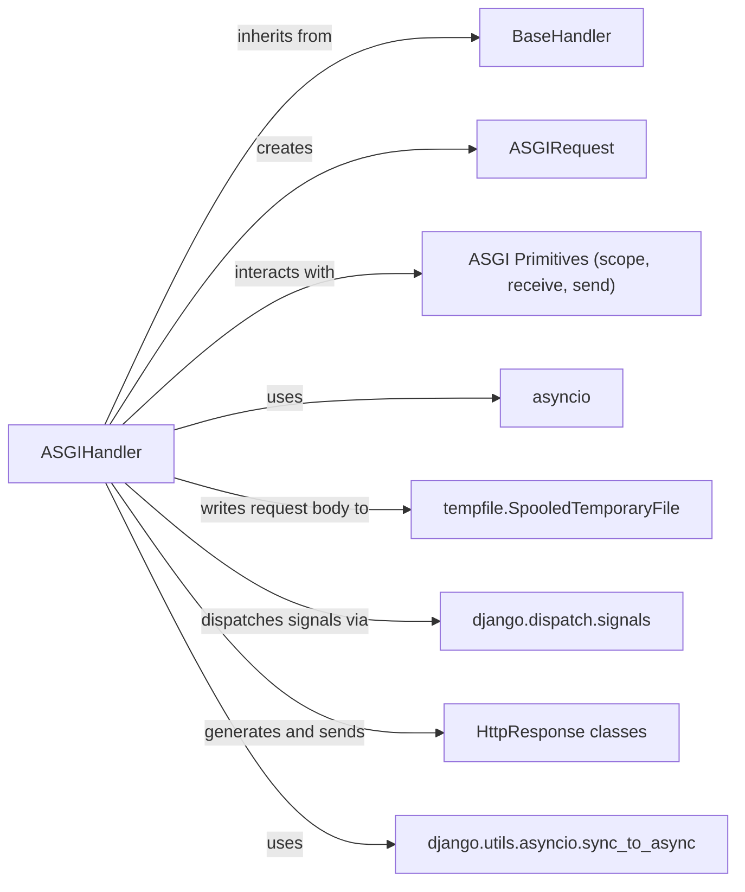

## Component Details

Analysis of core components and their relationships within Django's ASGIHandler, detailing how it processes asynchronous web requests.

### ASGIHandler
The ASGIHandler is the core entry point for asynchronous Django applications, implementing the ASGI protocol. It orchestrates the entire request-response lifecycle, from receiving ASGI messages (scope, receive, send) to processing the request through middleware, invoking the appropriate view, and finally sending the response back to the ASGI server. It handles asynchronous operations, including reading request bodies and managing concurrent tasks.

**Related Classes/Methods**:

- <a href="https://github.com/django/django/blob/master/django/core/handlers/asgi.py#L138-L380" target="_blank" rel="noopener noreferrer">`django.core.handlers.asgi.ASGIHandler` (138:380)</a>

### BaseHandler
BaseHandler is an abstract base class that provides the foundational logic for handling HTTP requests in Django. It defines the middleware loading mechanism and the core get_response method (with both synchronous and asynchronous variants) that processes requests through the middleware chain and dispatches them to views. ASGIHandler inherits from BaseHandler to leverage this common request processing infrastructure.

**Related Classes/Methods**:

- <a href="https://github.com/django/django/blob/master/django/core/handlers/base.py#L19-L364" target="_blank" rel="noopener noreferrer">`django.core.handlers.base.BaseHandler` (19:364)</a>

### ASGIRequest
ASGIRequest is a specialized subclass of Django's HttpRequest designed to encapsulate the ASGI scope and manage the request body as a file-like object. It parses ASGI-specific information (like method, path, headers) into the standard HttpRequest attributes, making ASGI requests compatible with Django's view and middleware system.

**Related Classes/Methods**:

- <a href="https://github.com/django/django/blob/master/django/core/handlers/asgi.py#L37-L135" target="_blank" rel="noopener noreferrer">`django.core.handlers.asgi.ASGIRequest` (37:135)</a>

### ASGI Primitives (scope, receive, send)
These are the fundamental communication interfaces provided by the ASGI server to the application. scope: A dictionary containing connection-specific information (e.g., type, method, path, headers). receive: An awaitable callable that yields incoming messages from the client (e.g., request body chunks, disconnect events). send: An awaitable callable that sends outgoing messages to the client (e.g., response status, headers, body chunks).

**Related Classes/Methods**: _None_

### asyncio
Python's built-in library for writing concurrent code using the async/await syntax. ASGIHandler heavily relies on asyncio for managing asynchronous operations, such as reading the request body, handling concurrent client disconnects, and running asynchronous views and middleware.

**Related Classes/Methods**: _None_

### tempfile.SpooledTemporaryFile
This utility is used by ASGIHandler to efficiently handle the incoming HTTP request body. It buffers the body content in memory up to a certain size and automatically spills it to a temporary disk file if the content exceeds that limit, preventing excessive memory consumption for large uploads.

**Related Classes/Methods**: _None_

### django.dispatch.signals
Django's signal dispatching mechanism allows decoupled components to send notifications and react to events within the application lifecycle. ASGIHandler dispatches signals like request_started and request_finished to inform other parts of the Django application about the beginning and end of a request.

**Related Classes/Methods**:

- <a href="https://github.com/django/django/blob/master/django/template/backends/django.py#L0-L0" target="_blank" rel="noopener noreferrer">`django.dispatch.signals` (0:0)</a>

### HttpResponse classes
This refers to the family of classes in django.http (e.g., HttpResponse, HttpResponseBadRequest, HttpResponseServerError, FileResponse) that represent the HTTP response sent back to the client. ASGIHandler is responsible for taking a Django HttpResponse object, encoding its headers and body, and sending it over the ASGI send channel.

**Related Classes/Methods**:

- <a href="https://github.com/django/django/blob/master/django/template/backends/django.py#L0-L0" target="_blank" rel="noopener noreferrer">`django.http.HttpResponse` (0:0)</a>

### django.utils.asyncio.sync_to_async
A utility function that allows synchronous (blocking) code to be executed safely within an asynchronous context without blocking the ASGI event loop. ASGIHandler uses this to run synchronous Django components (like certain middleware or parts of the view resolution) in a separate thread, bridging the synchronous and asynchronous worlds.

**Related Classes/Methods**:

- <a href="https://github.com/django/django/blob/master/django/utils/asyncio.py#L0-L0" target="_blank" rel="noopener noreferrer">`django.utils.asyncio.sync_to_async` (0:0)</a>

### [FAQ](https://github.com/CodeBoarding/GeneratedOnBoardings/tree/main?tab=readme-ov-file#faq)