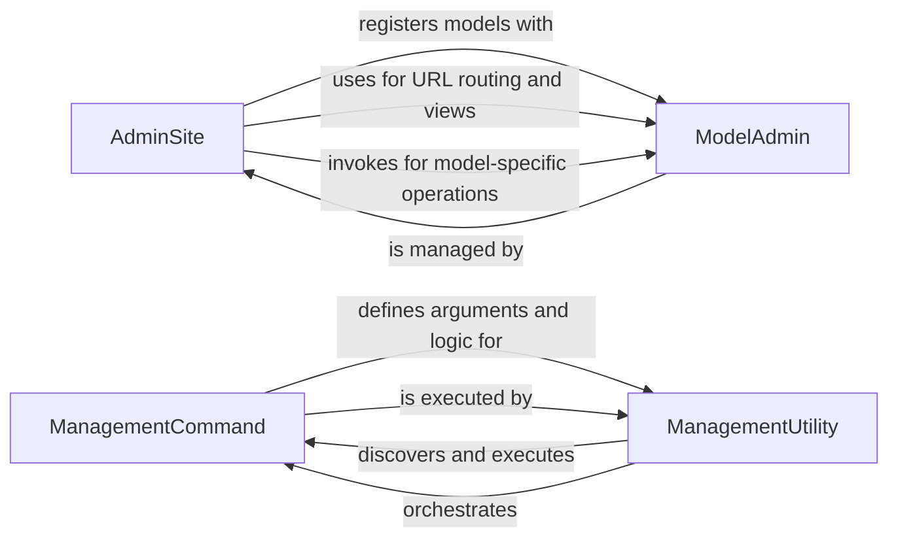

## Component Details

This graph illustrates the core components of Django's Admin and Management subsystems. The Admin subsystem, centered around `AdminSite` and `ModelAdmin`, provides an automatic administrative interface for managing database models. `AdminSite` acts as the central hub, registering models and handling routing, while `ModelAdmin` defines how individual models are displayed and managed within the admin. The Management subsystem, comprising `ManagementUtility` and `ManagementCommand`, offers a command-line interface for various project operations. `ManagementUtility` is responsible for discovering and executing management commands, and `ManagementCommand` defines the structure and logic for these commands, enabling tasks like running servers, managing migrations, and creating users.

### AdminSite
The AdminSite component encapsulates the Django admin application, managing the registration of models, handling URL routing for admin views, and providing core functionalities like user authentication, password changes, and displaying the admin index and app-specific pages. It acts as the central hub for the Django administration interface.

**Related Classes/Methods**:

- <a href="https://github.com/django/django/blob/master/django/contrib/admin/sites.py#L30-L606" target="_blank" rel="noopener noreferrer">`django.contrib.admin.sites.AdminSite` (30:606)</a>

### ModelAdmin
The ModelAdmin component provides the interface and logic for managing individual models within the Django admin. It defines how models are displayed, edited, added, and deleted, including functionalities for form generation, permission handling, search, filtering, and actions. It interacts closely with the AdminSite to integrate model-specific administration into the overall admin interface.

**Related Classes/Methods**:

- <a href="https://github.com/django/django/blob/master/django/contrib/admin/options.py#L635-L1000" target="_blank" rel="noopener noreferrer">`django.contrib.admin.options.ModelAdmin` (635:1000)</a>

### ManagementCommand
The ManagementCommand component provides the foundational structure for all Django management commands. It defines the command-line argument parsing, error handling, and execution flow for tasks that can be run via `django-admin` or `manage.py`. It includes mechanisms for system checks, migration checks, and output formatting.

**Related Classes/Methods**:

- <a href="https://github.com/django/django/blob/master/django/core/management/base.py#L187-L619" target="_blank" rel="noopener noreferrer">`django.core.management.base.BaseCommand` (187:619)</a>

### ManagementUtility
The ManagementUtility component is responsible for the overall execution of Django management commands. It handles the parsing of command-line arguments, fetching and loading the appropriate command class, and orchestrating the execution of the command. It also provides functionalities for displaying help text and handling command auto-completion.

**Related Classes/Methods**:

- `django.core.management.ManagementUtility` (full file reference)

### [FAQ](https://github.com/CodeBoarding/GeneratedOnBoardings/tree/main?tab=readme-ov-file#faq)