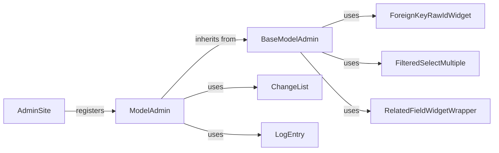

## Component Details

### AdminSite
The AdminSite class represents the Django admin site. It is responsible for registering models with the admin interface, providing the main entry point for accessing the admin, and handling user authentication and authorization. It centralizes the admin functionality and provides a consistent interface for managing different models.
- **Related Classes/Methods**: `django.contrib.admin.sites.AdminSite`

### ModelAdmin
The ModelAdmin class is a central class that provides an interface for managing models in the Django admin site. It defines how a model should be displayed and interacted with in the admin interface, including defining forms, list views, and actions. It acts as a bridge between the model and the admin interface, allowing customization of the admin experience for each model.
- **Related Classes/Methods**: `django.contrib.admin.options.ModelAdmin`

### BaseModelAdmin
BaseModelAdmin provides base functionalities and configurations for ModelAdmin, such as defining fields, fieldsets, readonly fields, and handling permissions. It serves as a foundation for ModelAdmin, providing common functionalities and configurations that can be customized in subclasses. It promotes code reuse and consistency across different ModelAdmin classes.
- **Related Classes/Methods**: `django.contrib.admin.options.BaseModelAdmin`

### ChangeList
The ChangeList class is responsible for generating the list view in the Django admin. It handles filtering, sorting, searching, and pagination of the objects in the list. It provides a structured way to display and interact with a list of model instances in the admin interface.
- **Related Classes/Methods**: `django.contrib.admin.views.main.ChangeList`

### LogEntry
The LogEntry model records actions performed in the Django admin, such as adding, changing, or deleting objects. It stores information about the user, content type, object ID, and change message. It provides an audit trail of changes made through the admin interface, allowing administrators to track and investigate actions performed on the data.
- **Related Classes/Methods**: `django.contrib.admin.models.LogEntry`

### ForeignKeyRawIdWidget
The ForeignKeyRawIdWidget is a widget used in the Django admin to represent foreign key fields as a simple text input for the raw ID. It provides a link to a popup window where the user can select the related object. It is useful when dealing with a large number of related objects, as it avoids loading all the related objects in a dropdown.
- **Related Classes/Methods**: `django.contrib.admin.widgets.ForeignKeyRawIdWidget`

### FilteredSelectMultiple
The FilteredSelectMultiple widget is used for multiple select fields in the Django admin. It provides a user-friendly interface for selecting multiple items from a list, with filtering capabilities. It is useful when dealing with a large number of options in a multiple select field, as it allows users to easily find and select the desired options.
- **Related Classes/Methods**: `django.contrib.admin.widgets.FilteredSelectMultiple`

### RelatedFieldWidgetWrapper
The RelatedFieldWidgetWrapper wraps a widget for a related field (ForeignKey or ManyToManyField) and adds a "plus" button next to the field. Clicking the button opens a popup window where the user can add a new related object. It provides a convenient way to add new related objects directly from the admin interface, without having to navigate to a separate page.
- **Related Classes/Methods**: `django.contrib.admin.widgets.RelatedFieldWidgetWrapper`
