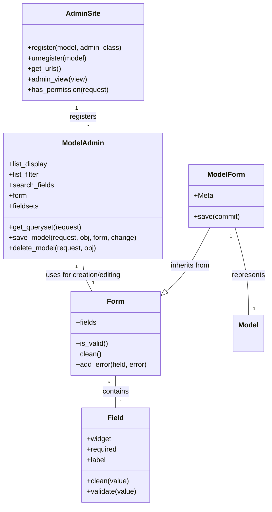

```tool_outputs
{"read_source_code_response": "{"output": ""}"}
```
Based on the provided information, here's a breakdown of the Django Admin Component:

**Description:**

The Django Admin component provides a built-in, automatically generated interface for managing the content of your Django project. It reads your models and provides a user interface to create, retrieve, update, and delete (CRUD) operations for your data. It handles user authentication, authorization, form generation, validation, and display.

**Main Classes and Their Purposes:**

*   **`AdminSite`**: This is the central class of the admin interface. It encapsulates an instance of the Django admin application. Models are registered with the `AdminSite` using the `register()` method. It also handles the overall admin site configuration, URL routing, and authentication.
*   **`ModelAdmin`**: This class represents the configuration for a specific model within the admin interface. It controls how the model is displayed and edited. You customize `ModelAdmin` subclasses to define list views, form fields, search, filtering, and more.
*   **`Form`**: Django's base form class. It handles form processing, validation, and rendering. In the context of the admin, it's used to generate forms for creating and editing model instances.
*   **`Field`**: Represents a single form field. It handles data conversion, validation, and widget rendering.
*   **`ModelForm`**: A form class that's automatically generated from a Django model. It simplifies the creation of forms that are directly tied to your model structure.

**Visualization:**

A class diagram is suitable for representing the structure of the Django Admin component, highlighting the relationships between the key classes.

