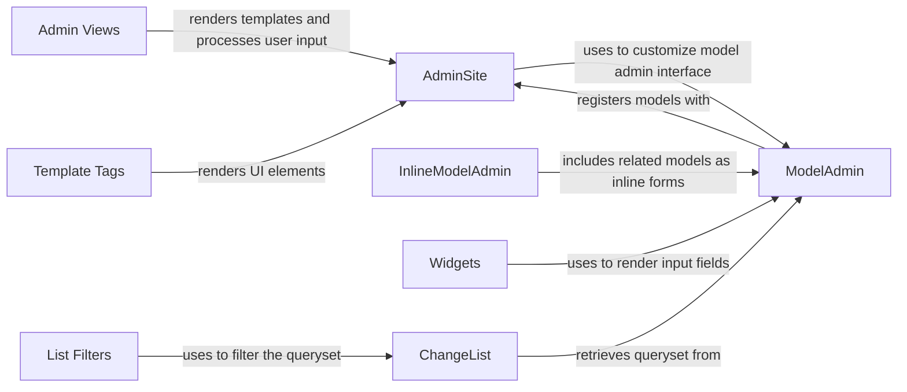

## Component Details

The Django Admin Interface provides a web-based interface for managing data models. It allows administrators to create, read, update, and delete objects, as well as perform other administrative tasks. The core of the admin interface revolves around the `AdminSite` which manages model registration and URL routing. `ModelAdmin` classes define the interface for specific models, controlling display, forms, and actions. InlineAdmin allows embedding related models. Views handle requests, while template tags render the UI. Widgets customize form inputs, and list filters enable data filtering. The system is highly customizable and extensible.

### AdminSite
The `AdminSite` class is the central component responsible for managing the registration of models and providing the main entry point for the admin interface. It handles URL routing, authentication, and rendering of the admin pages. It maintains a registry of `ModelAdmin` instances, associating each model with its corresponding admin configuration. It interacts with the authentication system to ensure that only authorized users can access the admin interface.
- **Related Classes/Methods**: `django.django.contrib.admin.sites.AdminSite`

### ModelAdmin
The `ModelAdmin` class defines the admin interface for a specific model. It controls the display of fields, the behavior of forms, and the available actions. It interacts with the `AdminSite` to register the model and customize its appearance in the admin interface. It uses widgets and filters to enhance the user experience. It defines methods for customizing the list view, the edit view, and the add view.
- **Related Classes/Methods**: `django.django.contrib.admin.options.ModelAdmin`, `django.django.contrib.admin.options.BaseModelAdmin`

### InlineModelAdmin
The `InlineModelAdmin` class allows you to include related models as inline forms within the admin interface for a parent model. This is useful for managing one-to-many or many-to-many relationships. It interacts with `ModelAdmin` to define how the inline forms are displayed and handled. It simplifies the process of editing related objects directly within the context of a parent object.
- **Related Classes/Methods**: `django.django.contrib.admin.options.InlineModelAdmin`

### Widgets
The `Widgets` module provides various form widgets for customizing the input fields in the admin interface. These widgets include specialized versions for dates, times, raw ID fields, and autocomplete fields. They interact with `ModelAdmin` to render the appropriate input fields for each model field. They provide a flexible way to control the appearance and behavior of form inputs.
- **Related Classes/Methods**: `django.django.contrib.admin.widgets`

### List Filters
List filters allow users to filter the list of objects displayed in the admin change list view. They provide a convenient way to narrow down the results based on specific criteria. They interact with `ChangeList` to filter the queryset. They are implemented as classes that inherit from `django.contrib.admin.filters.ListFilter`.
- **Related Classes/Methods**: `django.django.contrib.admin.filters`

### ChangeList
The `ChangeList` class is responsible for generating the list view of objects in the admin interface. It handles pagination, sorting, filtering, and searching. It interacts with `ModelAdmin` to retrieve the queryset and apply the appropriate filters and ordering. It constructs the context data needed to render the change list template.
- **Related Classes/Methods**: `django.django.contrib.admin.views.main.ChangeList`

### Admin Views
The `Admin Views` module contains the view functions that handle requests to the admin interface. These views include the change list view, the add view, the change view, and the delete view. They interact with `AdminSite` and `ModelAdmin` to render the appropriate templates and process user input. They handle authentication and authorization, ensuring that only authorized users can access the admin interface.
- **Related Classes/Methods**: `django.django.contrib.admin.views.main`, `django.django.contrib.admin.views.autocomplete`

### Template Tags
The `Template Tags` module provides various template tags for rendering the admin interface. These tags include tags for generating forms, lists, and other UI elements. They interact with `AdminSite` and `ModelAdmin` to render the appropriate content in the templates. They simplify the process of generating dynamic HTML content within the admin templates.
- **Related Classes/Methods**: `django.django.contrib.admin.templatetags`
