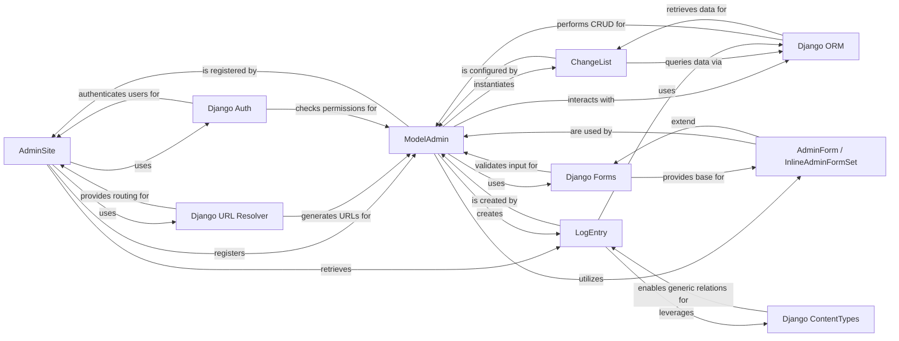

## Component Details

The Django Admin Interface is a powerful, "batteries-included" feature designed to provide a web-based graphical user interface for managing application data. It significantly reduces development time for backend administration by automatically generating CRUD (Create, Read, Update, Delete) interfaces for registered models. Its architecture is built upon several core Django components, leveraging the ORM, authentication system, and URL routing to deliver a robust and customizable administrative experience.

### AdminSite
The central orchestrator of the Django administration interface. It manages the registration of models with their respective `ModelAdmin` classes, handles URL routing for the entire admin site, and provides the overall context and views (e.g., login, logout, index, app index, password change). It acts as the primary entry point for all admin-related operations.

**Related Classes/Methods**:

- <a href="https://github.com/django/django/blob/master/django/contrib/admin/sites.py#L1-L1" target="_blank" rel="noopener noreferrer">`django/contrib/admin/sites` (1:1)</a>

### ModelAdmin
Defines the display, behavior, and options for a specific model within the Django admin interface. Developers customize `ModelAdmin` subclasses to control how their models are presented and interacted with, including defining list displays, search fields, filters, form fields, and actions. It is the primary customization point for tailoring the admin experience for individual models.

**Related Classes/Methods**:

- <a href="https://github.com/django/django/blob/master/django/contrib/admin/options.py#L1-L1" target="_blank" rel="noopener noreferrer">`django/contrib/admin/options` (1:1)</a>

### ChangeList
Responsible for handling the display and interaction of the list view for a model in the admin. It manages complex functionalities such as filtering, searching, pagination, and ordering of objects, providing a comprehensive interface for browsing and managing collections of model data.

**Related Classes/Methods**:

- <a href="https://github.com/django/django/blob/master/django/contrib/admin/views/main.py#L1-L1" target="_blank" rel="noopener noreferrer">`django/contrib/admin/views/main` (1:1)</a>

### LogEntry
A Django model used by the admin to record actions performed by users (e.g., adding, changing, or deleting objects). It provides a crucial audit trail for administrative activities, enhancing accountability and debugging within the admin interface.

**Related Classes/Methods**:

- <a href="https://github.com/django/django/blob/master/django/contrib/admin/models.py#L1-L1" target="_blank" rel="noopener noreferrer">`django/contrib/admin/models` (1:1)</a>

### AdminForm / InlineAdminFormSet
Helper classes that facilitate the rendering and processing of forms within the admin, specifically for `ModelAdmin` instances and inline related objects displayed on the same form. They provide structured access to form fields, fieldsets, and errors for efficient template rendering and data handling.

**Related Classes/Methods**:

- <a href="https://github.com/django/django/blob/master/django/contrib/admin/helpers.py#L1-L1" target="_blank" rel="noopener noreferrer">`django/contrib/admin/helpers` (1:1)</a>

### Django URL Resolver
Django's core URL routing system, responsible for mapping incoming URLs to the appropriate view functions and for generating URLs (e.g., using `reverse`). The Admin Interface extensively uses this for its navigation, action URLs, and dynamic content linking.

**Related Classes/Methods**: _None_

### Django Forms
Django's powerful and flexible form framework, used for handling form data input, validation, and rendering. The Admin Interface leverages this extensively for its add/change forms, search forms, and various configuration forms, ensuring data integrity and user-friendly input.

**Related Classes/Methods**: _None_

### Django ORM
Django's Object-Relational Mapper, providing a Pythonic way to interact with databases. The Admin Interface is built directly on top of the ORM to perform all CRUD (Create, Read, Update, Delete) operations on models, abstracting underlying database interactions.

**Related Classes/Methods**: _None_

### Django Auth
Django's built-in system for user authentication and authorization. The Admin Interface uses this to secure access to the administrative panel, manage user accounts, groups, and permissions, ensuring only authorized users can perform specific actions and view sensitive data.

**Related Classes/Methods**: _None_

### Django ContentTypes
A Django application that provides a generic interface for working with different types of installed models. It enables generic relationships, which are particularly useful in the Admin Interface for components like `LogEntry` to link to any model instance in the database, providing a flexible auditing mechanism.

**Related Classes/Methods**: _None_

### [FAQ](https://github.com/CodeBoarding/GeneratedOnBoardings/tree/main?tab=readme-ov-file#faq)