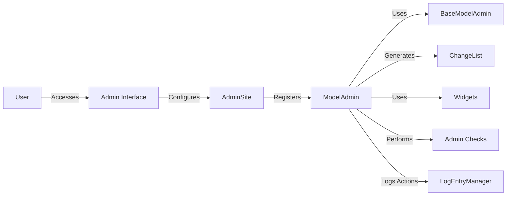

### Component Descriptions:

**1. User**
   - *Description*: Represents an administrator or content manager who interacts with the Django admin interface to manage the application's data.
   - *Interaction*: Accesses the Admin Interface to perform CRUD operations on data models.

**2. Admin Interface**
   - *Description*: Offers a built-in interface for managing the application's data models, simplifying content management and administrative tasks.
   - *Interaction*: Configured by the `AdminSite` to provide a user-friendly interface for managing models.
   - *Relevant source files*: `django.contrib.admin.sites`

**3. AdminSite**
   - *Description*: Encapsulates an instance of the Django admin application, managing model registration and providing admin interface URLs.
   - *Interaction*: Registers `ModelAdmin` classes for specific models, making them manageable through the admin interface.
   - *Relevant source files*: `django.contrib.admin.sites`

**4. ModelAdmin**
   - *Description*: Extends BaseModelAdmin to provide specific functionalities for model administration, including form and changelist generation, and response handling.
   - *Interaction*: Uses `BaseModelAdmin` for core functionalities, generates `ChangeList` for displaying lists of objects, uses `Widgets` for form rendering, performs `AdminChecks` for configuration validation, and logs actions via `LogEntryManager`.
   - *Relevant source files*: `django.contrib.admin.options`

**5. BaseModelAdmin**
   - *Description*: Provides core functionalities for admin options, such as form field generation and permission checks, serving as a base for ModelAdmin and InlineAdmin.
   - *Interaction*: Used by `ModelAdmin` to inherit core functionalities related to form and permission handling.
   - *Relevant source files*: `django.contrib.admin.options`

**6. ChangeList**
   - *Description*: Handles the display and filtering of lists of objects in the admin interface, managing pagination, search, and filtering.
   - *Interaction*: Generated by `ModelAdmin` to display and manage lists of model instances in the admin interface.
   - *Relevant source files*: `django.contrib.admin.views.main`

**7. Widgets**
   - *Description*: Provides various widgets for rendering form fields in the admin interface, including related field wrappers and autocomplete selects, enhancing the user interface.
   - *Interaction*: Used by `ModelAdmin` to render form fields in the admin interface.
   - *Relevant source files*: `django.contrib.admin.widgets`

**8. Admin Checks**
   - *Description*: Performs checks on ModelAdmin configurations to identify potential issues, ensuring proper setup and configuration.
   - *Interaction*: Performed by `ModelAdmin` to validate its configuration and identify potential issues.
   - *Relevant source files*: `django.contrib.admin.checks`

**9. LogEntryManager**
   - *Description*: Manages the creation of log entries for admin actions, tracking changes made through the admin interface.
   - *Interaction*: Used by `ModelAdmin` to log actions performed through the admin interface.
   - *Relevant source files*: `django.contrib.admin.models`
