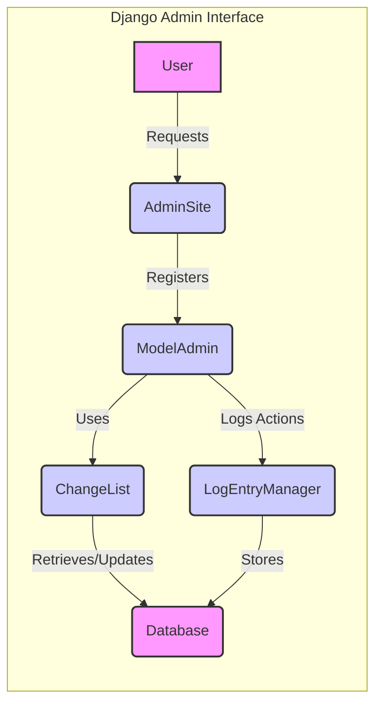

### Components Description:

**1. User:**
   - *Description*: Interacts with the Django Admin Interface to manage data.
   - *Interaction*: Initiates requests to the `AdminSite` to access and manipulate data.
   - *Relevant source files*: N/A

**2. AdminSite:**
   - *Description*: The central administration interface of Django. It handles user authentication, authorization, and URL routing for admin views. It also registers `ModelAdmin` classes for each model.
   - *Interaction*: Receives requests from the `User`, registers `ModelAdmin` classes, and uses them to manage models. It interacts with `ModelAdmin` to display and process data.
   - *Relevant source files*: `django.contrib.admin.sites.AdminSite`

**3. ModelAdmin:**
   - *Description*: Defines the admin interface for a specific model. It customizes the display and behavior of the admin interface, including list views, detail views, and forms. 
   - *Interaction*: Registered with `AdminSite`, uses `ChangeList` for list views, interacts with the database to retrieve and update data, and uses `LogEntryManager` to log actions.
   - *Relevant source files*: `django.contrib.admin.options.ModelAdmin`

**4. ChangeList:**
   - *Description*: Manages the display of lists of objects in the admin interface. It handles filtering, sorting, pagination, and search.
   - *Interaction*: Used by `ModelAdmin` to display lists of objects. It retrieves data from the database and renders the changelist template.
   - *Relevant source files*: `django.contrib.admin.views.main.ChangeList`

**5. Database:**
   - *Description*: Stores the application's data.
   - *Interaction*: Interacts with `ChangeList` and `ModelAdmin` to retrieve and update data. `LogEntryManager` also stores log entries in the database.
   - *Relevant source files*: N/A

**6. LogEntryManager:**
   - *Description*: Manages the logging of actions performed in the admin interface.
   - *Interaction*: Used by `ModelAdmin` to log actions such as adding, changing, and deleting objects. It stores log entries in the database.
   - *Relevant source files*: `django.contrib.admin.models.LogEntryManager`
