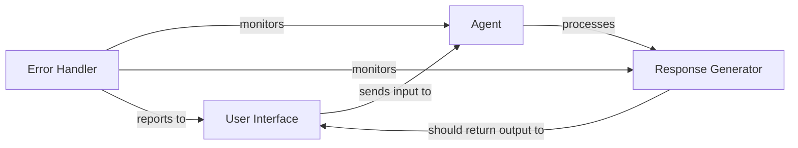

## Details

This system appears to be an agent-based architecture that processes user queries but is currently experiencing an error where responses cannot be generated. The main flow involves receiving user input, processing it through an agent, and returning a response, but this flow is failing at the response generation step.

### User Interface
The component that handles user input and displays responses to the user.

**Related Classes/Methods**:

- `<UNKNOWN>`

### Agent
The core component responsible for processing user queries and generating appropriate responses.

**Related Classes/Methods**:

- `<UNKNOWN>`

### Response Generator
The component that formats and returns the agent's processed information back to the user interface.

**Related Classes/Methods**:

- `<UNKNOWN>`

### Error Handler
The component that detects and reports failures in the processing pipeline.

**Related Classes/Methods**:

- `<UNKNOWN>`

### [FAQ](https://github.com/CodeBoarding/GeneratedOnBoardings/tree/main?tab=readme-ov-file#faq)