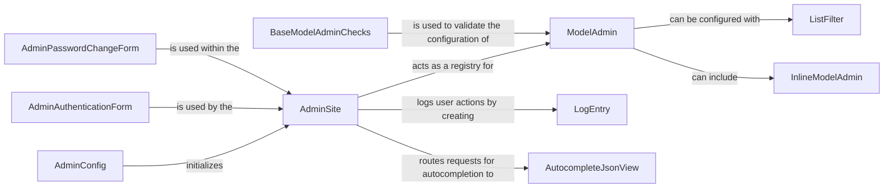

## Details

This document provides a detailed overview of the architecture of the Django Admin Interface, a core component of the Django web framework. The analysis is based on the class hierarchy and the relationships between the key components that make up the admin subsystem.

### AdminSite
The main entry point for the admin interface. It acts as a registry for models and handles URL dispatching.

**Related Classes/Methods**:

- `AdminSite`

### ModelAdmin
A class that provides a representation of a model in the admin interface. It is used to customize the admin's appearance and behavior for a specific model.

**Related Classes/Methods**:

- `ModelAdmin`

### InlineModelAdmin
A subclass of `ModelAdmin` that allows for the editing of related models on the same page as the parent model.

**Related Classes/Methods**:

- `InlineModelAdmin`

### LogEntry
A model that logs all actions taken by users in the admin interface, providing an audit trail.

**Related Classes/Methods**:

- `LogEntry`

### AdminAuthenticationForm
A form used to authenticate users logging into the admin interface.

**Related Classes/Methods**:

- `AdminAuthenticationForm`

### AdminPasswordChangeForm
A form that allows users to change their passwords within the admin interface.

**Related Classes/Methods**:

- `AdminPasswordChangeForm`

### AutocompleteJsonView
A view that provides JSON data for autocompleting form fields in the admin.

**Related Classes/Methods**:

- `AutocompleteJsonView`

### ListFilter
A class that defines how to filter the list of objects in the admin's change list view.

**Related Classes/Methods**:

- `ListFilter`

### AdminConfig
The application configuration for the admin interface, responsible for setting up the admin when a Django project starts.

**Related Classes/Methods**:

- `AdminConfig`

### BaseModelAdminChecks
A class that performs validation checks on `ModelAdmin` classes to ensure they are correctly configured.

**Related Classes/Methods**:

- `BaseModelAdminChecks`

### [FAQ](https://github.com/CodeBoarding/GeneratedOnBoardings/tree/main?tab=readme-ov-file#faq)