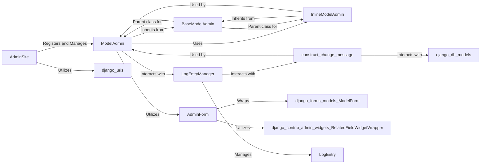

## Component Details

The `Admin Interface Core` component in Django provides the foundational elements for its powerful, automatically generated administrative interface. It enables developers to quickly establish a web-based backend for managing application data, encompassing user authentication, content types, and model-specific configurations. Its significance lies in offering a rapid and efficient method for data management without the need for custom view development.

### AdminSite
This is the central registry for all Django models exposed in the administrative interface. It manages the URL routing for admin pages, handles user authentication and permissions specific to admin views, and provides the overarching context for the entire admin site. It acts as the primary entry point for configuring and accessing the administrative backend.

**Related Classes/Methods**:

- `AdminSite` (1:1)

### ModelAdmin
This class is the cornerstone for customizing how a specific Django model behaves and appears within the admin interface. It allows developers to define list displays, search fields, filters, custom forms for object creation/modification, and granular permissions, thereby controlling the user experience for data management.

**Related Classes/Methods**:

- `ModelAdmin` (1:1)

### BaseModelAdmin
An abstract base class that provides common functionality and attributes shared by both `ModelAdmin` and `InlineModelAdmin`. It encapsulates core methods for handling form fields, permissions, queryset retrieval, and other general administrative tasks, promoting code reuse and ensuring consistency across different administrative configurations.

**Related Classes/Methods**:

- `BaseModelAdmin` (1:1)

### InlineModelAdmin
This class facilitates the display and editing of related objects directly within the parent object's change form in the admin interface. It is particularly useful for managing one-to-many or many-to-many relationships, allowing users to manipulate child objects without navigating to a separate page.

**Related Classes/Methods**:

- `InlineModelAdmin` (1:1)

### AdminForm
This helper class is responsible for rendering a `ModelForm` within the admin's add/change views. It organizes form fields into logical fieldsets, manages prepopulated fields, and handles read-only fields, providing a structured and customizable way to present the form to the user.

**Related Classes/Methods**:

- `AdminForm` (1:1)

### LogEntryManager
This manager is specifically designed for creating and managing `LogEntry` objects, which record every significant action performed within the Django admin interface (e.g., additions, changes, deletions). It provides a robust historical audit trail of all administrative operations.

**Related Classes/Methods**:

- `LogEntryManager` (1:1)

### construct_change_message
This utility function generates a structured message (often in JSON format) detailing the specific changes made to an object during an add or change operation in the admin. This message is then stored as part of the `LogEntry` for comprehensive auditing.

**Related Classes/Methods**:

- `construct_change_message` (1:1)

### [FAQ](https://github.com/CodeBoarding/GeneratedOnBoardings/tree/main?tab=readme-ov-file#faq)