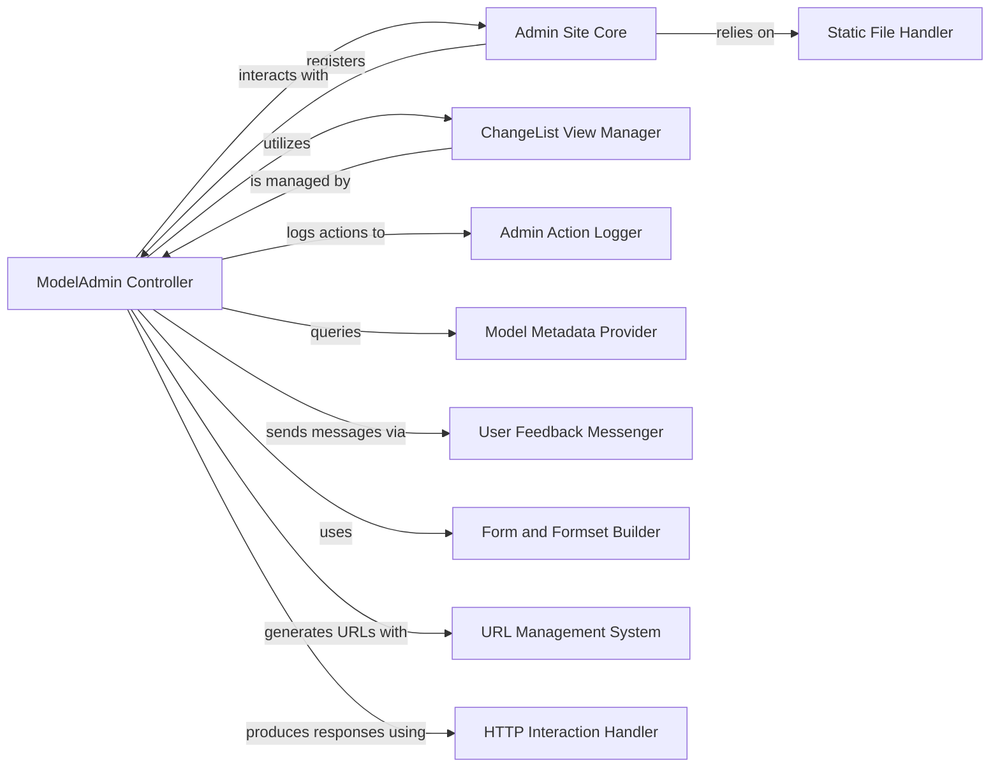

## Component Details

The Administrative & Contrib Applications subsystem provides Django's built-in administrative interface for managing application data. It encompasses core components responsible for model administration, user feedback, form handling, URL routing, and HTTP response generation, along with utilities for serving static files, enabling efficient data management and interaction within the Django framework.

### ModelAdmin Controller
The primary component responsible for managing the administrative interface for a specific Django model. It handles view logic for listing, adding, changing, and deleting objects, orchestrating interactions with other admin sub-components.

**Related Classes/Methods**:

- <a href="https://github.com/django/django/blob/master/django/contrib/admin/options.py#L634-L2340" target="_blank" rel="noopener noreferrer">`django.contrib.admin.options.ModelAdmin` (634:2340)</a>

### Admin Site Core
Represents the central administrative site, responsible for registering ModelAdmin instances, managing global admin views, and providing context for admin templates.

**Related Classes/Methods**:

- <a href="https://github.com/django/django/blob/master/django/contrib/admin/sites.py#L29-L605" target="_blank" rel="noopener noreferrer">`django.contrib.admin.sites.AdminSite` (29:605)</a>

### ChangeList View Manager
Manages the display and functionality of the object list page (changelist) in the admin, including handling filters, search, pagination, and bulk actions.

**Related Classes/Methods**:

- <a href="https://github.com/django/django/blob/master/django/contrib/admin/views/main.py#L64-L617" target="_blank" rel="noopener noreferrer">`django.contrib.admin.views.main.ChangeList` (64:617)</a>

### Admin Action Logger
Dedicated to recording all significant administrative operations (additions, modifications, deletions) on models, providing an auditable history within the admin.

**Related Classes/Methods**:

- <a href="https://github.com/django/django/blob/master/django/contrib/admin/models.py#L56-L198" target="_blank" rel="noopener noreferrer">`django.contrib.admin.models.LogEntry` (56:198)</a>

### Model Metadata Provider
Offers a standardized way to access and work with metadata about installed Django models, essential for dynamic operations like content type lookups and permissions.

**Related Classes/Methods**:

- <a href="https://github.com/django/django/blob/master/django/contrib/contenttypes/models.py#L133-L187" target="_blank" rel="noopener noreferrer">`django.contrib.contenttypes.models.ContentType` (133:187)</a>

### User Feedback Messenger
Provides a mechanism for displaying temporary, user-facing messages (e.g., success, warning, error) within the admin interface, enhancing user experience.

**Related Classes/Methods**:

- <a href="https://github.com/django/django/blob/master/django/contrib/messages/api.py#L21-L39" target="_blank" rel="noopener noreferrer">`django.contrib.messages.api.add_message` (21:39)</a>

### Form and Formset Builder
Encapsulates the logic for dynamically creating and managing Django forms and formsets, which are used for data input and validation in the admin's add/change views and list editable features.

**Related Classes/Methods**:

- `django.forms.Media` (full file reference)
- `django.forms.models.modelform_factory` (full file reference)
- `django.forms.models.modelformset_factory` (full file reference)
- `django.forms.CheckboxInput` (full file reference)
- `django.contrib.admin.forms.ActionForm` (full file reference)

### URL Management System
Handles the definition, resolution, and reversal of URLs specific to the Django admin application, ensuring correct navigation and linking within the interface.

**Related Classes/Methods**:

- `django.urls.path` (full file reference)
- `django.urls.reverse` (full file reference)

### HTTP Interaction Handler
Manages the low-level aspects of HTTP request processing and response generation within the admin, including redirects and rendering template-based responses for various admin views.

**Related Classes/Methods**:

- `django.http.HttpResponseRedirect` (full file reference)
- <a href="https://github.com/django/django/blob/master/django/template/response.py#L146-L163" target="_blank" rel="noopener noreferrer">`django.template.response.TemplateResponse` (146:163)</a>
- <a href="https://github.com/django/django/blob/master/django/template/response.py#L9-L143" target="_blank" rel="noopener noreferrer">`django.template.response.SimpleTemplateResponse` (9:143)</a>

### Static File Handler
Responsible for collecting, serving, and managing static files (CSS, JavaScript, images) specifically for the Django admin interface, ensuring its proper styling and functionality.

**Related Classes/Methods**:

- <a href="https://github.com/django/django/blob/master/django/contrib/staticfiles/storage.py#L15-L43" target="_blank" rel="noopener noreferrer">`django.contrib.staticfiles.storage.StaticFilesStorage` (15:43)</a>

### [FAQ](https://github.com/CodeBoarding/GeneratedOnBoardings/tree/main?tab=readme-ov-file#faq)