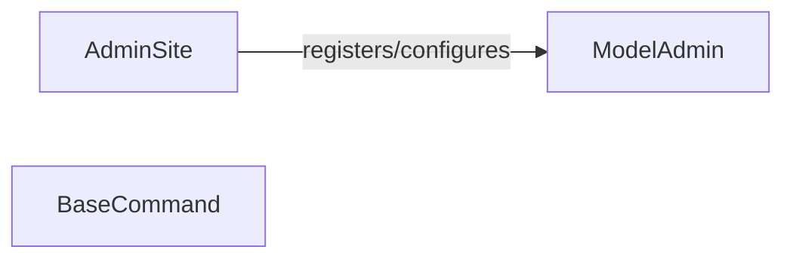

## Details

The `Administrative Tools` subsystem in Django provides a comprehensive set of functionalities for managing application data and performing system-level tasks. It encompasses both the web-based administrative interface, primarily driven by `django.contrib.admin`, and the command-line utilities facilitated by `django.core.management`. This subsystem acts as the primary interface for developers and administrators to interact with and maintain the Django application.

### AdminSite
This component serves as the central hub and registry for the Django administration interface. It orchestrates the display and management of registered models, handles URL routing for the admin, and provides the overarching structure and functionality of the web-based administrative panel. It's the primary entry point for interacting with the web-based administrative interface.

**Related Classes/Methods**:

- <a href="https://github.com/django/django//blob/django/contrib/admin/sites.py#L30-L606" target="_blank" rel="noopener noreferrer">`django.contrib.admin.sites.AdminSite`:30-606</a>

### ModelAdmin
This component defines the specific behavior and appearance of a single Django model within the Django admin interface. It allows developers to customize how a model's data is displayed (e.g., list fields, search fields), edited (e.g., form fields, widgets), searched, and filtered, tailoring the administrative experience for each data type.

**Related Classes/Methods**:

- <a href="https://github.com/django/django//blob/django/contrib/admin/options.py#L635-L2341" target="_blank" rel="noopener noreferrer">`django.contrib.admin.options.ModelAdmin`:635-2341</a>

### BaseCommand
This component serves as the foundational class for all Django management commands. These commands are command-line utilities that allow developers to perform various administrative and maintenance tasks, such as database migrations, creating superusers, clearing cache, or running custom scripts, outside of the web interface.

**Related Classes/Methods**:

- <a href="https://github.com/django/django//blob/django/core/management/base.py#L187-L619" target="_blank" rel="noopener noreferrer">`django.core.management.base.BaseCommand`:187-619</a>

### [FAQ](https://github.com/CodeBoarding/GeneratedOnBoardings/tree/main?tab=readme-ov-file#faq)