## Details

The `Administrative Tools` component in Django provides a comprehensive set of utilities for managing a Django project, encompassing both command-line interfaces and a web-based administration panel. Its core purpose is to facilitate development tasks, database management, and data administration through a user-friendly interface.

### django.core.management.base.BaseCommand
This is the abstract base class for all Django management commands. It defines the fundamental structure and parsing logic for command-line utilities, enabling developers to create and execute custom commands alongside built-in ones like `runserver`, `makemigrations`, and `migrate`.

**Related Classes/Methods**:

- <a href="https://github.com/django/django/blob/master/django/core/management/base.py#L1-L1" target="_blank" rel="noopener noreferrer">`django.core.management.base.BaseCommand` (1:1)</a>

### django.core.management.ManagementUtility
This class serves as the central dispatcher for all Django management commands. It is responsible for parsing command-line arguments, identifying the requested command, and executing the corresponding `BaseCommand` subclass.

**Related Classes/Methods**:

- `django.core.management.ManagementUtility` (1:1)

### django.contrib.admin.sites.AdminSite
This class is the central registry and orchestrator for the Django administration web interface. It manages the registration of models with their respective `ModelAdmin` configurations, handles URL routing for all admin views, and provides the overall framework for the administrative site.

**Related Classes/Methods**:

- <a href="https://github.com/django/django/blob/master/django/contrib/admin/sites.py#L29-L605" target="_blank" rel="noopener noreferrer">`django.contrib.admin.sites.AdminSite` (29:605)</a>

### django.contrib.admin.options.ModelAdmin
This class allows developers to define and customize how individual Django models are displayed, listed, filtered, searched, and edited within the `AdminSite`. It provides a powerful mechanism to tailor the administrative experience for specific application data.

**Related Classes/Methods**:

- <a href="https://github.com/django/django/blob/master/django/contrib/admin/options.py#L634-L2340" target="_blank" rel="noopener noreferrer">`django.contrib.admin.options.ModelAdmin` (634:2340)</a>

### django.contrib.auth.models.User
These are the built-in Django models for user authentication and authorization. They are critical for securing the admin interface, as administrators must log in and possess the necessary permissions to access and modify data.

**Related Classes/Methods**:

- <a href="https://github.com/django/django/blob/master/django/contrib/auth/models.py#L516-L525" target="_blank" rel="noopener noreferrer">`django.contrib.auth.models.User` (516:525)</a>

### django.contrib.auth.models.Group
These are the built-in Django models for user authentication and authorization. They are critical for securing the admin interface, as administrators must log in and possess the necessary permissions to access and modify data.

**Related Classes/Methods**:

- <a href="https://github.com/django/django/blob/master/django/contrib/auth/models.py#L101-L136" target="_blank" rel="noopener noreferrer">`django.contrib.auth.models.Group` (101:136)</a>

### django.contrib.admin.models.LogEntry
This model is used by the Django admin to record every action performed by users within the administration interface, such as adding, changing, or deleting objects. This provides a valuable audit trail.

**Related Classes/Methods**:

- <a href="https://github.com/django/django/blob/master/django/contrib/admin/models.py#L56-L198" target="_blank" rel="noopener noreferrer">`django.contrib.admin.models.LogEntry` (56:198)</a>

### django.forms.models.ModelForm
This class is a specialized Django Form that automatically builds a form from a Django model. The admin interface heavily relies on `ModelForm` to generate forms for creating, updating, and validating model instances.

**Related Classes/Methods**:

- <a href="https://github.com/django/django/blob/master/django/forms/models.py#L1-L1" target="_blank" rel="noopener noreferrer">`django.forms.models.ModelForm` (1:1)</a>

### django.db.models.base.Model
This is the base class for all Django models, representing the structure of data stored in the database. All data managed through the admin interface are instances of classes inheriting from `Model`.

**Related Classes/Methods**:

- <a href="https://github.com/django/django/blob/master/django/db/models/base.py#L480-L2407" target="_blank" rel="noopener noreferrer">`django.db.models.base.Model` (480:2407)</a>

### django.urls.resolvers.URLResolver
These classes are part of Django's URL routing system. The `AdminSite` dynamically generates URLs for its various views (e.g., list views, detail views for models), and these resolver classes are used to match incoming requests to the appropriate admin views.

**Related Classes/Methods**:

- <a href="https://github.com/django/django/blob/master/django/urls/resolvers.py#L1-L1" target="_blank" rel="noopener noreferrer">`django.urls.resolvers.URLResolver` (1:1)</a>

### django.urls.resolvers.URLPattern
These classes are part of Django's URL routing system. The `AdminSite` dynamically generates URLs for its various views (e.g., list views, detail views for models), and these resolver classes are used to match incoming requests to the appropriate admin views.

**Related Classes/Methods**:

- <a href="https://github.com/django/django/blob/master/django/urls/resolvers.py#L1-L1" target="_blank" rel="noopener noreferrer">`django.urls.resolvers.URLPattern` (1:1)</a>

### django.template.backends.django.DjangoTemplates
This component is Django's default templating engine, responsible for rendering HTML templates. The administrative interface uses this engine to display its various pages, including lists of objects, forms for editing, and the dashboard.

**Related Classes/Methods**:

- <a href="https://github.com/django/django/blob/master/django/template/backends/django.py#L15-L89" target="_blank" rel="noopener noreferrer">`django.template.backends.django.DjangoTemplates` (15:89)</a>

### [FAQ](https://github.com/CodeBoarding/GeneratedOnBoardings/tree/main?tab=readme-ov-file#faq)