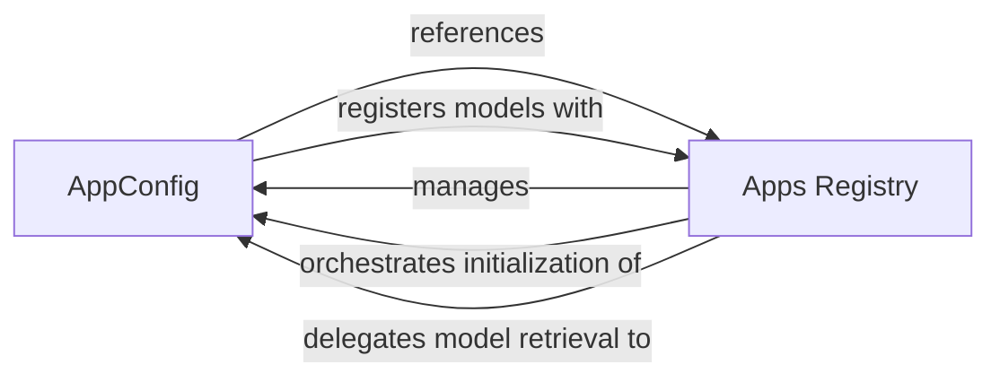

## Component Details

This subsystem focuses on how Django applications are configured, loaded, and managed within a project. The two fundamental components are AppConfig and the Apps Registry (represented by the Apps class). They are crucial because AppConfig defines the individual application's metadata and lifecycle hooks, while the Apps Registry acts as the central orchestrator, managing all installed applications and their models, ensuring proper loading and accessibility throughout the Django project's runtime.

### AppConfig
Represents the configuration for a single Django application. Each installed application has an AppConfig instance registered within the Apps Registry. It encapsulates metadata such as the app's name, label, and path, and defines the logic for importing the app's models and performing app-specific initialization (e.g., the ready() method). It serves as a base class that developers can extend to customize their application's behavior during startup.

**Related Classes/Methods**:

- <a href="https://github.com/django/django/blob/master/django/apps/config.py#L1-L1" target="_blank" rel="noopener noreferrer">`django/apps/config.py:ready` (1:1)</a>
- <a href="https://github.com/django/django/blob/master/django/apps/config.py#L1-L1" target="_blank" rel="noopener noreferrer">`django/apps/config.py:get_model` (1:1)</a>
- <a href="https://github.com/django/django/blob/master/django/apps/config.py#L1-L1" target="_blank" rel="noopener noreferrer">`django/apps/config.py:get_models` (1:1)</a>
- <a href="https://github.com/django/django/blob/master/django/apps/config.py#L1-L1" target="_blank" rel="noopener noreferrer">`django/apps/config.py:import_models` (1:1)</a>
- <a href="https://github.com/django/django/blob/master/django/apps/config.py#L1-L1" target="_blank" rel="noopener noreferrer">`django/apps/config.py:create` (1:1)</a>

### Apps Registry
This is the central registry for all Django applications. It manages the loading, configuration, and state of applications throughout the Django project's lifecycle. It provides methods to access application configurations, retrieve models, and check the readiness of the app registry. It is a singleton instance, typically accessed globally via django.apps.apps, ensuring a single, authoritative source for application information.

**Related Classes/Methods**:

- <a href="https://github.com/django/django/blob/master/django/apps/registry.py#L1-L1" target="_blank" rel="noopener noreferrer">`django/apps/registry.py:populate` (1:1)</a>
- <a href="https://github.com/django/django/blob/master/django/apps/registry.py#L1-L1" target="_blank" rel="noopener noreferrer">`django/apps/registry.py:get_app_configs` (1:1)</a>
- <a href="https://github.com/django/django/blob/master/django/apps/registry.py#L1-L1" target="_blank" rel="noopener noreferrer">`django/apps/registry.py:get_app_config` (1:1)</a>
- <a href="https://github.com/django/django/blob/master/django/apps/registry.py#L1-L1" target="_blank" rel="noopener noreferrer">`django/apps/registry.py:get_model` (1:1)</a>
- <a href="https://github.com/django/django/blob/master/django/apps/registry.py#L1-L1" target="_blank" rel="noopener noreferrer">`django/apps/registry.py:get_models` (1:1)</a>
- <a href="https://github.com/django/django/blob/master/django/apps/registry.py#L1-L1" target="_blank" rel="noopener noreferrer">`django/apps/registry.py:check_models_ready` (1:1)</a>
- <a href="https://github.com/django/django/blob/master/django/apps/registry.py#L1-L1" target="_blank" rel="noopener noreferrer">`django/apps/registry.py:all_models` (1:1)</a>
- <a href="https://github.com/django/django/blob/master/django/apps/registry.py#L1-L1" target="_blank" rel="noopener noreferrer">`django/apps/registry.py:register_model` (1:1)</a>

### [FAQ](https://github.com/CodeBoarding/GeneratedOnBoardings/tree/main?tab=readme-ov-file#faq)