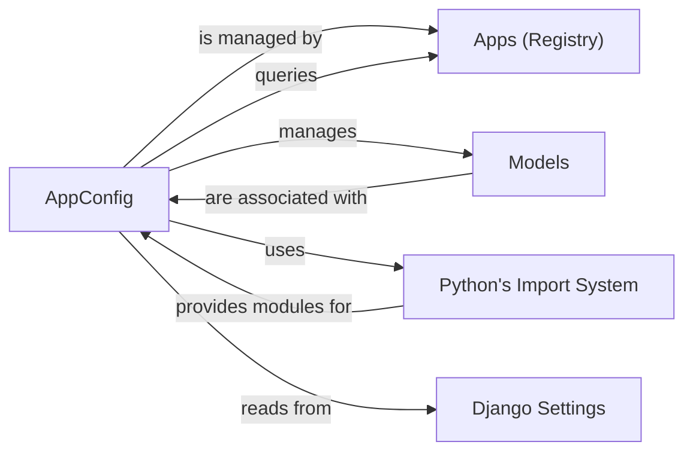

## Component Details

Analysis of the AppConfig component in Django and its fundamental relationships with other core Django components.

### AppConfig
Represents the configuration of a single Django application. It provides metadata about the app (e.g., name, label, verbose name, path) and defines hooks for application-specific initialization, such as the `ready()` method, which is called once Django is fully loaded. It also manages the loading and access of models within its associated application.

**Related Classes/Methods**:

- `AppConfig` (0:0)

### Apps (Registry)
A central registry that holds and manages all `AppConfig` instances loaded in a Django project. It orchestrates the application startup process, including calling `ready()` methods, and provides a unified interface for accessing models across all applications.

**Related Classes/Methods**:

- <a href="https://github.com/django/django/blob/master/django/contrib/postgres/apps.py#L0-L0" target="_blank" rel="noopener noreferrer">`Apps` (0:0)</a>

### Models
Python classes that define the structure and behavior of data stored in the database. Each `AppConfig` is responsible for loading and providing access to the models defined within its application.

**Related Classes/Methods**: _None_

### Python's Import System
The built-in mechanism in Python for locating and loading modules and packages. `AppConfig` heavily relies on this system, particularly in its `create` method and `import_models` method, to dynamically load application modules and `AppConfig` subclasses based on `INSTALLED_APPS` settings.

**Related Classes/Methods**: _None_

### Django Settings
A module (`django.conf.settings`) that provides project-wide configuration variables. `AppConfig` can read certain settings (e.g., `DEFAULT_AUTO_FIELD`) to influence its behavior or the behavior of models it manages.

**Related Classes/Methods**:

- <a href="https://github.com/django/django/blob/master/django/template/backends/django.py#L0-L0" target="_blank" rel="noopener noreferrer">`django.conf.settings` (0:0)</a>

### [FAQ](https://github.com/CodeBoarding/GeneratedOnBoardings/tree/main?tab=readme-ov-file#faq)